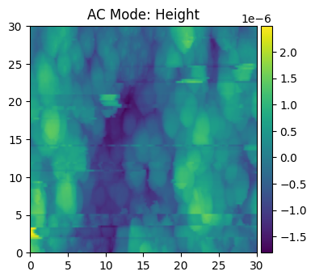
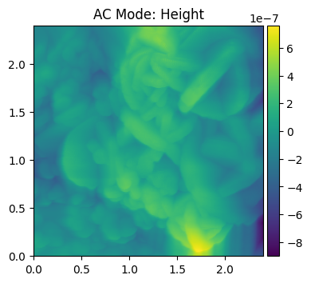
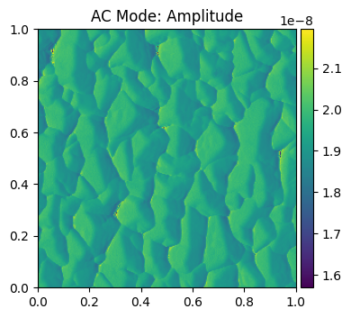

# ofdspm
## Outlier/Failure Detector for Scanning Probe Microscopes at the Image Level
This is a working repository for a solution to errors presented in scanning probe microscopes between the trace and retrace. Ideally, the difference between the values measured should be zero between the trace and retrace, but in reality they are not. 

This leads to several issues with images created from the SPM, including "bad" images and lines where the tip fails to get accurate readings. Sample images are given below.

<p float="left">
  
  
</p>

For reference, good images do not have tip failures from the SPM. These images are given below:
<p float="left">
  
  
</p>


With reference to the AESPM library, this repository explores ways to develop algorithms to detect "bad" images either as a result of statistical anomalies or from machine learning.
+ Refer to the Jupyter notebook `simulator.ipynb` for this exploration.

This repository also has a few CLI files that may be used to test and train a machine learning (ML) algorithm to classify a given `.ibw` file as "good" or "bad" based on a select sample of manually-reviewed files. At the current status of this repository, it appears that the model is highly biased towards good images (imbalance with the number of bad images), and as such is **good at detecting good images, but not good at detecting bad images**. A new (larger) dataset will likely improve the performance analytics.

## Files
This repository contains a main Jupyter notebook, `simulator.ipnyb`, which outlines the development of several Python scripts and algorithms to classify and handle these images. The notebook also expands on previous libraries for processing `.ibw` files and even synthesizing good and bad images.

Data is taken from `.ibw` files and placed into **pandas DataFrames** to be analyzed by the ML algorithm. Currently, the algorithm chosen is **RandomForestClassifier**, specifically chosen for its accuracy from experimentation and efficiency. The synthesis script uses **XGBoostClassifier** as its model because of the large synthesized training set.

### List of Files/Folders
+ `images/`   (folder): Images folder for documentation/readme.md
+ `sample_data/`  (folder): Given `.ibw` files, unsorted/cleaned.
+ `sorted_data/`  (folder):   Manually-sorted `.ibw` files, cleaned.
+ `RandomForest_model.pkl`    (ML model): Pickled ML model from the most recent sample training.
+ `synthetic_image_quality_model.pkl` (ML model): Pickled ML model from the most recent synthetic training.
+ `requirements.txt`    (text): Requirements file for external libs.
+ `simulator.ipynb` (Jupyter notebook): As referenced above, contains the main development workflow.
+ `test.py` (script):   Test script for training and testing a model with real images (no CLI).
+ `train.py` (script):  Used for training a synthetic ML model for testing with real images (contains CLI).
+ `utils.py` (module):  Contains shared utility functions used for feature extraction, residuals, and statistics.

## Effectiveness
The effectiveness of the current ML model is limited by the sorted data set. Currently, there are **58 good images and 14 bad images**. This is not nearly enough and introduces bias to the training set. Using the standard 80/20% split, the ML model is excellent at finding good images, but suffers at finding bad images.

A sample output from `test.py` is given below:
```
=== TRAINING ML MODEL (MATCHED TO PREDICTION) ===
Target channels: ['Height', 'Amplitude', 'Phase', 'ZSensor']
Expected features: 4 channels * 4 stats + 6 pairs = 22
Found 58 good image files
Found 14 bad image files
Feature names (22): ['Amplitude_std', 'Amplitude_range', 'Amplitude_entropy', 'Amplitude_skew', 'Height_std', 'Height_range', 'Height_entropy', 'Height_skew', 'Phase_std', 'Phase_range', 'Phase_entropy', 'Phase_skew', 'ZSensor_std', 'ZSensor_range', 'ZSensor_entropy', 'ZSensor_skew', 'Amplitude_Height_residual', 'Amplitude_Phase_residual', 'Amplitude_ZSensor_residual', 'Height_Phase_residual', 'Height_ZSensor_residual', 'Phase_ZSensor_residual']
Successfully processed 58 good images
Successfully processed 14 bad images
Final training data: 72 samples, 22 features
Good images: 58, Bad images: 14
Training accuracy: 1.000
Test accuracy: 1.000
Cross-validation score: 0.876 (+/- 0.094)

Top 10 Most Important Features:
            feature  importance
0     Amplitude_std    0.132955
7       Height_skew    0.127915
11       Phase_skew    0.094534
8         Phase_std    0.085190
4        Height_std    0.084544
3    Amplitude_skew    0.081063
15     ZSensor_skew    0.065603
1   Amplitude_range    0.043449
9       Phase_range    0.039667
13    ZSensor_range    0.033934
Model saved as 'RandomForest_model.pkl'
Size of data (rows): 256
Current mode: AC Mode
Channels: ['Height', 'Amplitude', 'Phase', 'ZSensor']
Size (meters): 2e-06
ML feature vector shape: (1, 22)
Expected features: 4 channels * 4 stats + 6 residuals = 22
=== ENHANCED FAILURE ANALYSIS ===
Traditional failure: False (score: 0 of 0)
Multiple entropy failure: True (score: 4 flags of 4)
High proximity failure: True (score: 0.998)
ML failure: False (probability: 0.000)
OVERALL FAILURE: False

=== PROXIMITY TO THRESHOLDS ===
Height:
  std_proximity: 1.001 CLOSE
  range_proximity: 0.985 CLOSE
  skew_proximity: 1.000 CLOSE
Amplitude:
  std_proximity: 1.007 CLOSE
  range_proximity: 0.986 CLOSE
  skew_proximity: 1.006 CLOSE
Phase:
  std_proximity: 1.005 CLOSE
  range_proximity: 0.993 CLOSE
  skew_proximity: 1.004 CLOSE
ZSensor:
  std_proximity: 1.000 CLOSE
  range_proximity: 0.988 CLOSE
  skew_proximity: 1.003 CLOSE

=== TOP CONTRIBUTING FEATURES (ML) ===
Amplitude_std: 0.133
Height_skew: 0.128
Phase_skew: 0.095
Phase_std: 0.085
Height_std: 0.085
Amplitude_skew: 0.081
ZSensor_skew: 0.066
Amplitude_range: 0.043
```

Since this output contains a lot of clutter, it is important to note that **this program only considers the classification output of the ML model, labeled `ML failure`**. Other sample statistics are placed for debugging and observational purposes only. Though there is significant impact from the good images about thresholds (they impact the weights of the training columns), in reality they do not change between runs or changes between files.

**To improve or modify the ML source files**, more files must be added to the `sorted_data/` directory in this repo.