# ofdspm
## Outlier/Failure Detector for Scanning Probe Microscopes at the Image Level
This is a working repository for a solution to errors presented in scanning probe microscopes between the trace and retrace. Ideally, the difference between the values measured should be zero between the trace and retrace, but in reality they are not. 

This leads to several issues with images created from the SPM, including "bad" images and lines where the tip fails to get accurate readings. Sample images are given below.

<p float="left">
  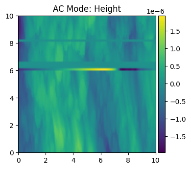
  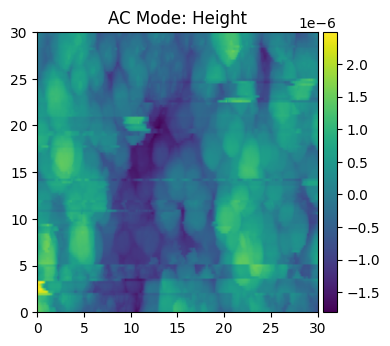
</p>

For reference, good images do not have tip failures from the SPM. These images are given below:
<p float="left">
  
  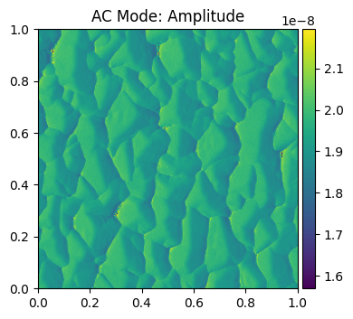
</p>


With reference to the `aespm library`, this repository explores ways to develop algorithms to detect "bad" images either as a result of statistical anomalies or from machine learning.
+ Refer to the Jupyter notebook `simulator.ipynb` for this exploration.

This repository also has a few CLI files that may be used to test and train a machine learning (ML) algorithm to classify a given `.ibw` file as "good" or "bad" based on a select sample of manually-reviewed files. At the current status of this repository, it appears that the model is highly biased towards good images (imbalance with the number of bad images), and as such is **good at detecting good images, but not good at detecting bad images**. A new (larger) dataset will likely improve the performance analytics.

## Files
This repository contains a main Jupyter notebook, `simulator.ipnyb`, which outlines the development of several Python scripts and algorithms to classify and handle these images. The notebook also expands on previous libraries for processing `.ibw` files and even synthesizing good and bad images.

Data is taken from `.ibw` files and placed into **pandas DataFrames** to be analyzed by the ML algorithm. Currently, the algorithm chosen is **RandomForestClassifier**, specifically chosen for its accuracy from experimentation and efficiency. The synthesis script uses **XGBoostClassifier** as its model because of the large synthesized training set.

## Methodology
The method by which a ML algorithm is trained and tested for several source files varies by the type of model created. For real images, a RandomForestClassifier model is chosen for its experimental accuracy and ease. For synthesized images, the XGBooostClassifier algorithm is used instead.

The method by which data is taken from the `.ibw` files and converted into **pandas DataFrames** is through means of the `aespm library`'s tools to manage, view, and store values from these files.

Since some of the source files contain different channels of information, this repository elected to grab the four most common channels and train the ML model on those:
+ Height
+ Amplitude
+ Phase
+ ZSensor

Currently, most images exist as 256-by-256-point DataFrames with four channels per point. Since this repo is handling point-based classification, this implies why RandomForestClassifier is being used for tabular/structured data.

## Effectiveness
The effectiveness of the current ML model is limited by the sorted data set. Currently, there are **58 good images and 14 bad images**. This is not nearly enough and introduces bias to the training set. Using the standard 80/20% split, the ML model is excellent at finding good images, but suffers at finding bad images.

A sample output from `test.py` is given below:
```
=== TRAINING ML MODEL (MATCHED TO PREDICTION) ===
Target channels: ['Height', 'Amplitude', 'Phase', 'ZSensor']
Expected features: 4 channels * 4 stats + 6 pairs = 22
Found 58 good image files
Found 14 bad image files
Feature names (22): ['Amplitude_std', 'Amplitude_range', 'Amplitude_entropy', 'Amplitude_skew', 'Height_std', 'Height_range', 'Height_entropy', 'Height_skew', 'Phase_std', 'Phase_range', 'Phase_entropy', 'Phase_skew', 'ZSensor_std', 'ZSensor_range', 'ZSensor_entropy', 'ZSensor_skew', 'Amplitude_Height_residual', 'Amplitude_Phase_residual', 'Amplitude_ZSensor_residual', 'Height_Phase_residual', 'Height_ZSensor_residual', 'Phase_ZSensor_residual']
Successfully processed 58 good images
Successfully processed 14 bad images
Final training data: 72 samples, 22 features
Good images: 58, Bad images: 14
Training accuracy: 1.000
Test accuracy: 1.000
Cross-validation score: 0.876 (+/- 0.094)

Top 10 Most Important Features:
            feature  importance
0     Amplitude_std    0.132955
7       Height_skew    0.127915
11       Phase_skew    0.094534
8         Phase_std    0.085190
4        Height_std    0.084544
3    Amplitude_skew    0.081063
15     ZSensor_skew    0.065603
1   Amplitude_range    0.043449
9       Phase_range    0.039667
13    ZSensor_range    0.033934
Model saved as 'RandomForest_model.pkl'
Size of data (rows): 256
Current mode: AC Mode
Channels: ['Height', 'Amplitude', 'Phase', 'ZSensor']
Size (meters): 2e-06
ML feature vector shape: (1, 22)
Expected features: 4 channels * 4 stats + 6 residuals = 22
=== ENHANCED FAILURE ANALYSIS ===
Traditional failure: False (score: 0 of 0)
Multiple entropy failure: True (score: 4 flags of 4)
High proximity failure: True (score: 0.998)
ML failure: False (probability: 0.000)
OVERALL FAILURE: False

=== PROXIMITY TO THRESHOLDS ===
Height:
  std_proximity: 1.001 CLOSE
  range_proximity: 0.985 CLOSE
  skew_proximity: 1.000 CLOSE
Amplitude:
  std_proximity: 1.007 CLOSE
  range_proximity: 0.986 CLOSE
  skew_proximity: 1.006 CLOSE
Phase:
  std_proximity: 1.005 CLOSE
  range_proximity: 0.993 CLOSE
  skew_proximity: 1.004 CLOSE
ZSensor:
  std_proximity: 1.000 CLOSE
  range_proximity: 0.988 CLOSE
  skew_proximity: 1.003 CLOSE

=== TOP CONTRIBUTING FEATURES (ML) ===
Amplitude_std: 0.133
Height_skew: 0.128
Phase_skew: 0.095
Phase_std: 0.085
Height_std: 0.085
Amplitude_skew: 0.081
ZSensor_skew: 0.066
Amplitude_range: 0.043
```

Since this output contains a lot of clutter, it is important to note that **this program only considers the classification output of the ML model, labeled `ML failure`**. Other sample statistics are placed for debugging and observational purposes only. Though there is significant impact from the good images about thresholds (they impact the weights of the training columns), in reality they do not change between runs or changes between files.

**To improve or modify the ML source files**, more files must be added to the `sorted_data/` directory in this repo.

### Training a Synthetic Model (XGBoostClassifier)
To train a synthetic model using `train.py`, there is a CLI interface and some code that can be modified. Although the entire interface has not been written, it is still possible to generate, view, and train a model to a specific size. The CLI is as follows:

```
Main function call:
For CLI:
+ Use --show to show the synthetic sample, if needed
+ Use --generate to generate a new ML model. Configure the size of the synthesized set as needed.
+ Use --file {str} to choose the file other than the default to compare.

Actions:
+ Creates a synthetic image to view
+ Creates a batch of synthetic images to train a new model if requested
+ Checks the given file against created thresholds from given data and the ML's decision
+ Outputs results
```

The reason that **this model uses XGBoostClassifier** is because it performs slightly better with large datasets (thousands of points in this case), as compared to the RandomForestsClassifier given for the real images. This can be modified within the source file, but experimentation might cause the training model to take many more minutes/hours than the current version.

### Training a ML Model (RandomForestsClassifier) Using Real Images
To train a ML model using real `.ibw` files, the `test.py` file can automatically refer to the repo's `sorted_data/` folder and train and test a model. There is not a CLI for this tester yet, but one may be added in the future. The default image is a good image, and the result above is from that image's run.

Experiment with the accuracy of the ML model in predicting the impact of the four chosen channels of data on the classification of good or bad.

## Sample Outputs and Analysis
This section will contain some sample images/outputs from the ML training and how they relate to whether or not the model has been trained well.

### Bad Images
The ML model is trained with the same set (although random training/testing set), so we can expect it to behave relatively the same per run.

The bad images (3) chosen for this test run are shown below with their paths.

#### Bad Image 1
Path: `sorted_data/bad_images/PositionC_30Cs70M0000.ibw`
<p float="left">
  
  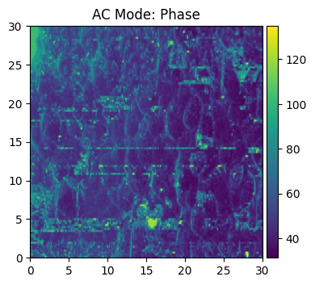
</p>
<p float="left">
  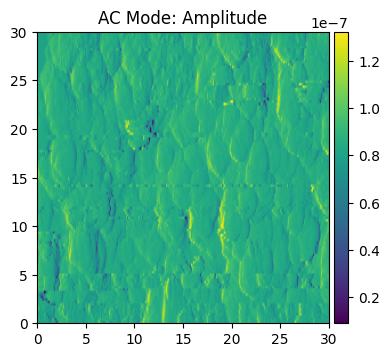
  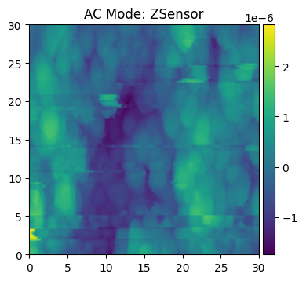
</p>

The following is the output from the `test.py` training with this filepath given (truncated):
```
=== TRAINING ML MODEL (MATCHED TO PREDICTION) ===
Target channels: ['Height', 'Amplitude', 'Phase', 'ZSensor']
Expected features: 4 channels * 4 stats + 6 pairs = 22
Found 58 good image files
Found 14 bad image files
Feature names (22): ['Amplitude_std', 'Amplitude_range', 'Amplitude_entropy', 'Amplitude_skew', 'Height_std', 'Height_range', 'Height_entropy', 'Height_skew', 'Phase_std', 'Phase_range', 'Phase_entropy', 'Phase_skew', 'ZSensor_std', 'ZSensor_range', 'ZSensor_entropy', 'ZSensor_skew', 'Amplitude_Height_residual', 'Amplitude_Phase_residual', 'Amplitude_ZSensor_residual', 'Height_Phase_residual', 'Height_ZSensor_residual', 'Phase_ZSensor_residual']
Successfully processed 58 good images
Successfully processed 14 bad images
Final training data: 72 samples, 22 features
Good images: 58, Bad images: 14
Training accuracy: 1.000
Test accuracy: 1.000
Cross-validation score: 0.876 (+/- 0.094)

Top 10 Most Important Features:
            feature  importance
0     Amplitude_std    0.132955
7       Height_skew    0.127915
11       Phase_skew    0.094534
8         Phase_std    0.085190
4        Height_std    0.084544
3    Amplitude_skew    0.081063
15     ZSensor_skew    0.065603
1   Amplitude_range    0.043449
9       Phase_range    0.039667
13    ZSensor_range    0.033934
Model saved as 'RandomForest_model.pkl'
Size of data (rows): 118
Current mode: AC Mode
Channels: ['Height', 'Amplitude', 'Phase', 'ZSensor']
Size (meters): 3e-05
ML feature vector shape: (1, 22)
Expected features: 4 channels * 4 stats + 6 residuals = 22
=== ENHANCED FAILURE ANALYSIS ===
Traditional failure: False (score: 0 of 0)
Multiple entropy failure: True (score: 4 flags of 4)
High proximity failure: False (score: 0.662)
ML failure: True (probability: 0.680)
OVERALL FAILURE: False
```

**ML failure: True (probability: 0.680)**

#### Bad Image 2

Path: `sorted_data/bad_images/H_90Cs10MA_0006.ibw`
<p float="left">
  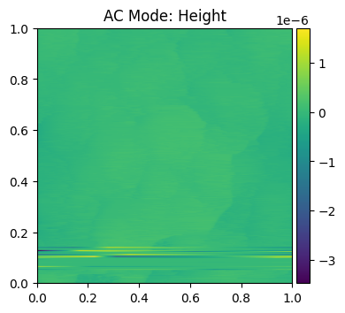
  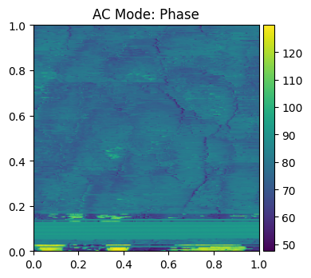
</p>
<p float="left">
  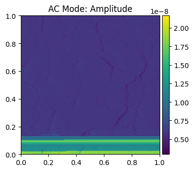
  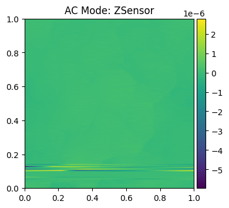
</p>

The following is the output from the `test.py` training with this filepath given (truncated):
```
=== TRAINING ML MODEL (MATCHED TO PREDICTION) ===
Target channels: ['Height', 'Amplitude', 'Phase', 'ZSensor']
Expected features: 4 channels * 4 stats + 6 pairs = 22
Found 58 good image files
Found 14 bad image files
Feature names (22): ['Amplitude_std', 'Amplitude_range', 'Amplitude_entropy', 'Amplitude_skew', 'Height_std', 'Height_range', 'Height_entropy', 'Height_skew', 'Phase_std', 'Phase_range', 'Phase_entropy', 'Phase_skew', 'ZSensor_std', 'ZSensor_range', 'ZSensor_entropy', 'ZSensor_skew', 'Amplitude_Height_residual', 'Amplitude_Phase_residual', 'Amplitude_ZSensor_residual', 'Height_Phase_residual', 'Height_ZSensor_residual', 'Phase_ZSensor_residual']
Successfully processed 58 good images
Successfully processed 14 bad images
Final training data: 72 samples, 22 features
Good images: 58, Bad images: 14
Training accuracy: 1.000
Test accuracy: 1.000
Cross-validation score: 0.876 (+/- 0.094)

Top 10 Most Important Features:
            feature  importance
0     Amplitude_std    0.132955
7       Height_skew    0.127915
11       Phase_skew    0.094534
8         Phase_std    0.085190
4        Height_std    0.084544
3    Amplitude_skew    0.081063
15     ZSensor_skew    0.065603
1   Amplitude_range    0.043449
9       Phase_range    0.039667
13    ZSensor_range    0.033934
Model saved as 'RandomForest_model.pkl'
Size of data (rows): 256
Current mode: AC Mode
Channels: ['Height', 'Amplitude', 'Phase', 'ZSensor']
Size (meters): 1e-06
ML feature vector shape: (1, 22)
Expected features: 4 channels * 4 stats + 6 residuals = 22
=== ENHANCED FAILURE ANALYSIS ===
Traditional failure: False (score: 0 of 0)
Multiple entropy failure: True (score: 4 flags of 4)
High proximity failure: False (score: 0.710)
ML failure: True (probability: 0.780)
OVERALL FAILURE: False
```

**ML failure: True (probability: 0.780)**

#### Bad Image 3
Path: `sorted_data/bad_images/H_90Cs10MA_0004.ibw`
<p float="left">
  
  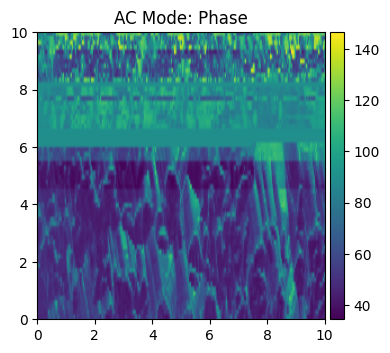
</p>
<p float="left">
  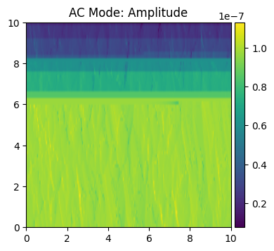
  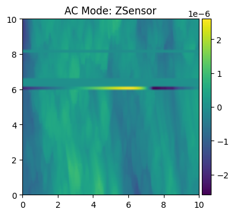
</p>
The following is the output from the `test.py` training with this filepath given (truncated):

```
=== TRAINING ML MODEL (MATCHED TO PREDICTION) ===
Target channels: ['Height', 'Amplitude', 'Phase', 'ZSensor']
Expected features: 4 channels * 4 stats + 6 pairs = 22
Found 58 good image files
Found 14 bad image files
Feature names (22): ['Amplitude_std', 'Amplitude_range', 'Amplitude_entropy', 'Amplitude_skew', 'Height_std', 'Height_range', 'Height_entropy', 'Height_skew', 'Phase_std', 'Phase_range', 'Phase_entropy', 'Phase_skew', 'ZSensor_std', 'ZSensor_range', 'ZSensor_entropy', 'ZSensor_skew', 'Amplitude_Height_residual', 'Amplitude_Phase_residual', 'Amplitude_ZSensor_residual', 'Height_Phase_residual', 'Height_ZSensor_residual', 'Phase_ZSensor_residual']
Successfully processed 58 good images
Successfully processed 14 bad images
Final training data: 72 samples, 22 features
Good images: 58, Bad images: 14
Training accuracy: 1.000
Test accuracy: 1.000
Cross-validation score: 0.876 (+/- 0.094)

Top 10 Most Important Features:
            feature  importance
0     Amplitude_std    0.132955
7       Height_skew    0.127915
11       Phase_skew    0.094534
8         Phase_std    0.085190
4        Height_std    0.084544
3    Amplitude_skew    0.081063
15     ZSensor_skew    0.065603
1   Amplitude_range    0.043449
9       Phase_range    0.039667
13    ZSensor_range    0.033934
Model saved as 'RandomForest_model.pkl'
Size of data (rows): 62
Current mode: AC Mode
Channels: ['Height', 'Amplitude', 'Phase', 'ZSensor']
Size (meters): 1e-05
ML feature vector shape: (1, 22)
Expected features: 4 channels * 4 stats + 6 residuals = 22
=== ENHANCED FAILURE ANALYSIS ===
Traditional failure: False (score: 0 of 0)
Multiple entropy failure: True (score: 4 flags of 4)
High proximity failure: False (score: 0.660)
ML failure: True (probability: 0.700)
OVERALL FAILURE: False
```
**ML failure: True (probability: 0.700)**

#### Analysis
The three samples given all show the ML succeeding in identifying them as "bad images." Though, it must be mentioned that these images represent a select sample of images that *can be sampled*. Since many `.ibw` files do not contain the four channels that the ML is training on, it is not possible to predict with these files. They still may be used for creating thresholds and training the ML.

The average score from these images is **0.720**. So, we can state that the ML model is about 72% confident that these images are "bad images".

Next, we should look at how the model classifies known good images.

### Good Images
The good images (3) chosen for this test run are shown below with their paths.

#### Good Image 1
Path: `sorted_data/good_images/HeightCali0027.ibw`
<p float="left">
  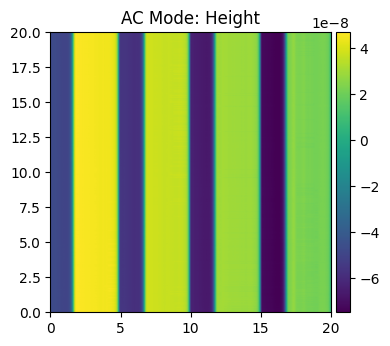
  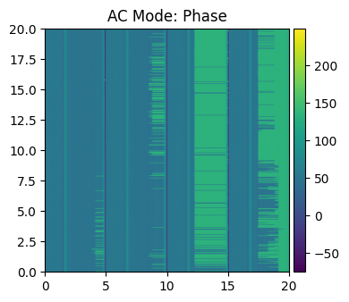
</p>
<p float="left">
  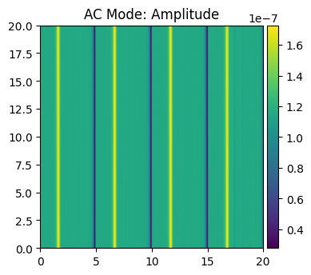
  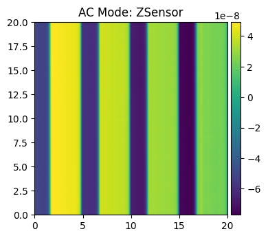
</p>

The following is the output from the `test.py` training with this filepath given (truncated):
```
=== TRAINING ML MODEL (MATCHED TO PREDICTION) ===
Target channels: ['Height', 'Amplitude', 'Phase', 'ZSensor']
Expected features: 4 channels * 4 stats + 6 pairs = 22
Found 58 good image files
Found 14 bad image files
Feature names (22): ['Amplitude_std', 'Amplitude_range', 'Amplitude_entropy', 'Amplitude_skew', 'Height_std', 'Height_range', 'Height_entropy', 'Height_skew', 'Phase_std', 'Phase_range', 'Phase_entropy', 'Phase_skew', 'ZSensor_std', 'ZSensor_range', 'ZSensor_entropy', 'ZSensor_skew', 'Amplitude_Height_residual', 'Amplitude_Phase_residual', 'Amplitude_ZSensor_residual', 'Height_Phase_residual', 'Height_ZSensor_residual', 'Phase_ZSensor_residual']
Successfully processed 58 good images
Successfully processed 14 bad images
Final training data: 72 samples, 22 features
Good images: 58, Bad images: 14
Training accuracy: 1.000
Test accuracy: 1.000
Cross-validation score: 0.876 (+/- 0.094)

Top 10 Most Important Features:
            feature  importance
0     Amplitude_std    0.132955
7       Height_skew    0.127915
11       Phase_skew    0.094534
8         Phase_std    0.085190
4        Height_std    0.084544
3    Amplitude_skew    0.081063
15     ZSensor_skew    0.065603
1   Amplitude_range    0.043449
9       Phase_range    0.039667
13    ZSensor_range    0.033934
Model saved as 'RandomForest_model.pkl'
Size of data (rows): 512
Current mode: AC Mode
Channels: ['Height', 'Amplitude', 'Phase', 'ZSensor']
Size (meters): 2e-05
ML feature vector shape: (1, 22)
Expected features: 4 channels * 4 stats + 6 residuals = 22
=== ENHANCED FAILURE ANALYSIS ===
Traditional failure: False (score: 0 of 0)
Multiple entropy failure: False (score: 0 flags of 4)
High proximity failure: False (score: 0.430)
ML failure: False (probability: 0.030)
OVERALL FAILURE: False
```

**ML failure: False (probability: 0.030)**

#### Good Image 2
Path: `sorted_data/good_images/PTO_AC_0000.ibw`

<p float="left">
  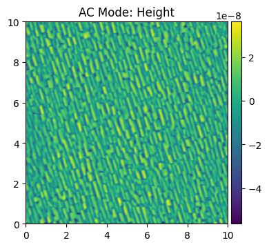
  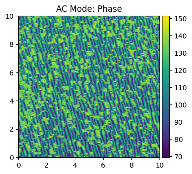
</p>
<p float="left">
  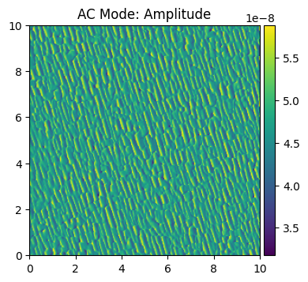
  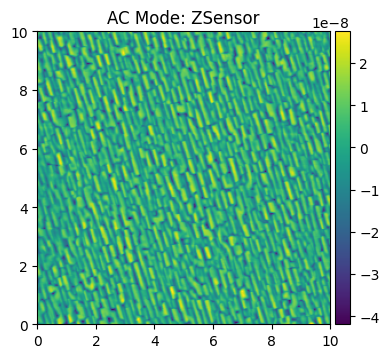
</p>

The following is the output from the `test.py` training with this filepath given (truncated):

```
=== TRAINING ML MODEL (MATCHED TO PREDICTION) ===
Target channels: ['Height', 'Amplitude', 'Phase', 'ZSensor']
Expected features: 4 channels * 4 stats + 6 pairs = 22
Found 58 good image files
Found 14 bad image files
Feature names (22): ['Amplitude_std', 'Amplitude_range', 'Amplitude_entropy', 'Amplitude_skew', 'Height_std', 'Height_range', 'Height_entropy', 'Height_skew', 'Phase_std', 'Phase_range', 'Phase_entropy', 'Phase_skew', 'ZSensor_std', 'ZSensor_range', 'ZSensor_entropy', 'ZSensor_skew', 'Amplitude_Height_residual', 'Amplitude_Phase_residual', 'Amplitude_ZSensor_residual', 'Height_Phase_residual', 'Height_ZSensor_residual', 'Phase_ZSensor_residual']
Successfully processed 58 good images
Successfully processed 14 bad images
Final training data: 72 samples, 22 features
Good images: 58, Bad images: 14
Training accuracy: 1.000
Test accuracy: 1.000
Cross-validation score: 0.876 (+/- 0.094)

Top 10 Most Important Features:
            feature  importance
0     Amplitude_std    0.132955
7       Height_skew    0.127915
11       Phase_skew    0.094534
8         Phase_std    0.085190
4        Height_std    0.084544
3    Amplitude_skew    0.081063
15     ZSensor_skew    0.065603
1   Amplitude_range    0.043449
9       Phase_range    0.039667
13    ZSensor_range    0.033934
Model saved as 'RandomForest_model.pkl'
Size of data (rows): 256
Current mode: AC Mode
Channels: ['Height', 'Amplitude', 'Phase', 'ZSensor']
Size (meters): 1e-05
ML feature vector shape: (1, 22)
Expected features: 4 channels * 4 stats + 6 residuals = 22
=== ENHANCED FAILURE ANALYSIS ===
Traditional failure: False (score: 0 of 0)
Multiple entropy failure: True (score: 4 flags of 4)
High proximity failure: True (score: 0.994)
ML failure: False (probability: 0.010)
OVERALL FAILURE: False
```
**ML failure: False (probability: 0.010)**

#### Good Image 3
Path: `sorted_data/good_images/Cs50MA50approx_0003.ibw`

<p float="left">
  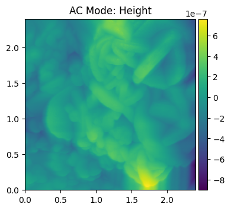
  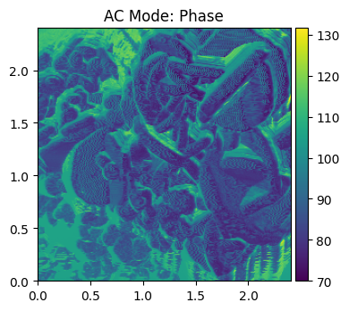
</p>
<p float="left">
  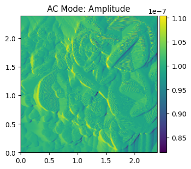
  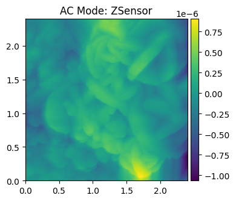
</p>

The following is the output from the `test.py` training with this filepath given (truncated):
```
=== TRAINING ML MODEL (MATCHED TO PREDICTION) ===
Target channels: ['Height', 'Amplitude', 'Phase', 'ZSensor']
Expected features: 4 channels * 4 stats + 6 pairs = 22
Found 58 good image files
Found 14 bad image files
Feature names (22): ['Amplitude_std', 'Amplitude_range', 'Amplitude_entropy', 'Amplitude_skew', 'Height_std', 'Height_range', 'Height_entropy', 'Height_skew', 'Phase_std', 'Phase_range', 'Phase_entropy', 'Phase_skew', 'ZSensor_std', 'ZSensor_range', 'ZSensor_entropy', 'ZSensor_skew', 'Amplitude_Height_residual', 'Amplitude_Phase_residual', 'Amplitude_ZSensor_residual', 'Height_Phase_residual', 'Height_ZSensor_residual', 'Phase_ZSensor_residual']
Successfully processed 58 good images
Successfully processed 14 bad images
Final training data: 72 samples, 22 features
Good images: 58, Bad images: 14
Training accuracy: 1.000
Test accuracy: 1.000
Cross-validation score: 0.876 (+/- 0.094)

Top 10 Most Important Features:
            feature  importance
0     Amplitude_std    0.132955
7       Height_skew    0.127915
11       Phase_skew    0.094534
8         Phase_std    0.085190
4        Height_std    0.084544
3    Amplitude_skew    0.081063
15     ZSensor_skew    0.065603
1   Amplitude_range    0.043449
9       Phase_range    0.039667
13    ZSensor_range    0.033934
Model saved as 'RandomForest_model.pkl'
Size of data (rows): 256
Current mode: AC Mode
Channels: ['Height', 'Amplitude', 'Phase', 'ZSensor']
Size (meters): 2.4e-06
ML feature vector shape: (1, 22)
Expected features: 4 channels * 4 stats + 6 residuals = 22
=== ENHANCED FAILURE ANALYSIS ===
Traditional failure: False (score: 0 of 0)
Multiple entropy failure: True (score: 4 flags of 4)
High proximity failure: True (score: 0.801)
ML failure: False (probability: 0.000)
OVERALL FAILURE: False
```

**ML failure: False (probability: 0.000)**

#### Analysis
The ML is fairly confident with detecting good images. This is likely explained by the current testing set, because most of the images given are "good images."

The average score from these images is **0.013**. We should likely explore the ML's ability to detect more "difficult-to-see" good images.

## Benchmarking Models
To benchmark various models using an AUC - ROC curve, the script in `benchmark.ipynb` is able to take any given model and test/train set to create benchmark statistics and identify the accuracy of the model on a test set. Though the current data sets that the repository is working with are small, it is possible that if the data fed into these algorithms is increased, we can successfully identify the best model and the metrics that cause failures.

Refer to the code in `utils.py` (utility module) for the functions used to determine the scores and metrics from this process.

## Using Trace and Retrace Data to Train Models
Instead of working at the direct image level (where traces and retraces) are combined, we can instead focus on using discrepancies among the trace and retrace data to identify faults.

**Though this is a predecessor to real-time image processing with traces and retraces**, it is still possible to get much more accurate results from statistical issues within the traces and retraces, especially as we gradually move to creating models that can be fed predictors instead of an entire set of data.

The notebook, `trace_retrace.ipynb` contains this exploration of using metrics from the trace and retrace data to train and test ML models. These models are also benchmarked, though it appears the dataset is too small for there to be any clear winner.

The script `trace_run.py` also contains a CLI for user input, allowing the user run the training and testing, as well as view sample outputs from any `.pickle` file given for prediction.

Below is a sample output:
<p align="center">
  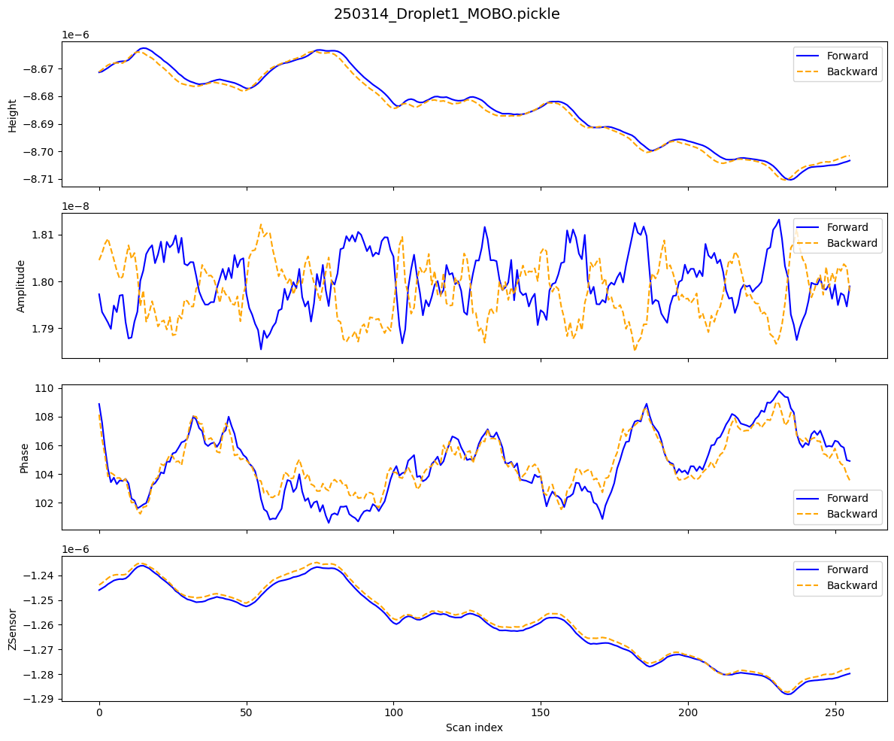
</p>


```
Extracted 55 features from file
Available features: ['Height_corr', 'Height_mae', 'Height_max_err', 'Height_std_residual', 'Height_area_diff', 'Height_entropy', 'Height_skew', 'Height_kurtosis', 'Height_std_fwd', 'Height_range_fwd', 'Amplitude_corr', 'Amplitude_mae', 'Amplitude_max_err', 'Amplitude_std_residual', 'Amplitude_area_diff', 'Amplitude_entropy', 'Amplitude_skew', 'Amplitude_kurtosis', 'Amplitude_std_fwd', 'Amplitude_range_fwd', 'Phase_corr', 'Phase_mae', 'Phase_max_err', 'Phase_std_residual', 'Phase_area_diff', 'Phase_entropy', 'Phase_skew', 'Phase_kurtosis', 'Phase_std_fwd', 'Phase_range_fwd', 'ZSensor_corr', 'ZSensor_mae', 'ZSensor_max_err', 'ZSensor_std_residual', 'ZSensor_area_diff', 'ZSensor_entropy', 'ZSensor_skew', 'ZSensor_kurtosis', 'ZSensor_std_fwd', 'ZSensor_range_fwd', 'drive', 'setpoint', 'I_gain', 'Height_ZSensor_residual_corr', 'Amplitude_Height_residual_corr', 'Amplitude_Phase_residual_corr', 'Phase_ZSensor_residual_corr', 'topo_Height_mean', 'topo_Height_std', 'topo_Amplitude_mean', 'topo_Amplitude_std', 'topo_Phase_mean', 'topo_Phase_std', 'topo_ZSensor_mean', 'topo_ZSensor_std']
Model expects 55 features (no feature names available)
Final feature vector shape: (1, 55)
Prediction: Good (confidence: 0.910)
```

What is considered "good" versus "bad" is still arbitrarily set with various thresholds in order to make training sets. This points us at finding special metrics to identify possible failures in the tip in real time.

## Self-Supervised Image Detection Models
This section focuses on improving both the accuracy and real-time capabilities of this project in that we will use real experimental data to train either pre-trained CNNs or develop an encoder based on augmented images from the experiment.

The experiment ran included purposefully damaging the tip by gradually decreasing the setpoint so that the tip endures more pressure. The intent is that the data will reflect the changes in the tip to the extent that some classifier model can understand the relationship between visual image quality and the relationships with data.

### Methodology
Two models will be trained and analyzed based on specific design criteria. The models will be fed images (raw, RGB image data, cropped and/or augmneted), to train on feature detection. A reward-based, minimization of loss training program will be run on these problems to use a physics-based reward function derived and weighted exeprimentally.

#### **Reward Function**
+ **Height Consistency** (Trace vs Retrace) - MAE between two values
+ **Phase Consistency** (Trace vs Retrace) - MSE between values
+ **Image Sharpness/Focus** (using gradient variance, for the CNN's image training)
+ **Signal-to-Noise Ratio of Height** (SNR, for the CNN's features training)
+ **Data Quality** (check for artifacts, clips, or excess saturation)
+ **Scan Index Penalty** (prefer earlier scans, indicating tip quality based on experiment)
+ **Scan Rate Appropriateness** (if outside of the set range of 2Hz)

```
weights = {
        'height_consistency': 0.25,
        'phase_consistency': 0.25, 
        'sharpness': 0.15,
        'snr': 0.15,
        'data_diversity': 0.1,
        'tip_freshness': 0.08,
        'scan_rate': 0.02
}

    # Weighted combination
    total_reward = sum(weights[key] * rewards[key] for key in weights.keys())
    
    return total_reward, rewards  # `rewards` is the dictionary of components
```

This reward function is used in both models to guide the training of a 5-class multiclass classifier model to **predict the gradual status of the tip**.

#### Experiment Procedure
The procedure of this experiment was to create arbitrary classes of tip damage based on the scan index. The goal for this is to create some defineable trend between "new" tips and "broken" tips by classifying even groups of scans in order from the first scan on a new tip to the last. The classifiers built from these images will then need to be able to identify which group, or what condition, the current image is in.

The intent for this is that a smaller, sample image (86x86), can be **fed into the model during machine runtime**, which will allow the user to receive classifier information about the predicted status of the tip based on its training. This may be important to either **identify causes for failure or prevent tip failure in the current scan in real time**.

#### **Model Types**
1. **ResNet18 with ImageNetV1 weights (pretrained CNN)**. A classifier is built using these weights but the CNN is encouraged to focus on images it is not sure on depending on the reward calculated per image augment.
+ This model combines both image training (fault detection and edge detection) with a hybrid approach of self-supervised learning from loss minimization of both classification loss *and* reward loss. The goal for this hybridized approach was to allow the image-based model to train on real data and the appearance of the image (height channel), as to build some relationship with image data based on reward calculations.
2. **Barlow Twins encoder** created from augmented (cropped, rotated) image data. A classifier is built on top of this encoder for the same classes as the pretrained CNN above.
+ This model combines the Barlow Twins approach for finding discrepancies between pairs of augmented images (height channel) and real data from the experiment to reinforce trends that may indicate the tip's condition.

Both models were fed cropped images (3x3 crops from the original 256x256-point image), which will be important later for the discussion of usecases.

#### Training Data
Both models were trained locally using hardware acceleration (CUDA), of which the number of epochs and reinforcement are:
1. **Pretrained CNN**: 4 epochs (ran into performance issues), with 5112 samples from augmented data from 71 files (72 times augmentation ratio). Training/validation batches were 256/64.
2. **Barlow Twins**: ~350 epochs to convergence for decoder. Classifier was trained to about ~400 epochs until reaching near-convergence at 60% accuracy.

Both models were trained with the same experimental dataset of 71 images (36 read-out images, 35 wear-out images.)

### Analysis and Comparison
After training, the models were put through similar analysis as mutliclass classifiers. The following trends and images describe both their accuracy as well as their performance.

#### Pretrained CNN (Hybrid Model)
**Scan Index Versus Classification**
<p align="center">
  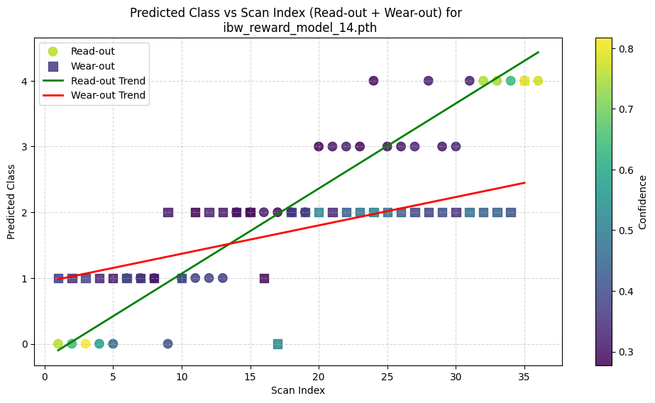
</p>

<p align="center">
  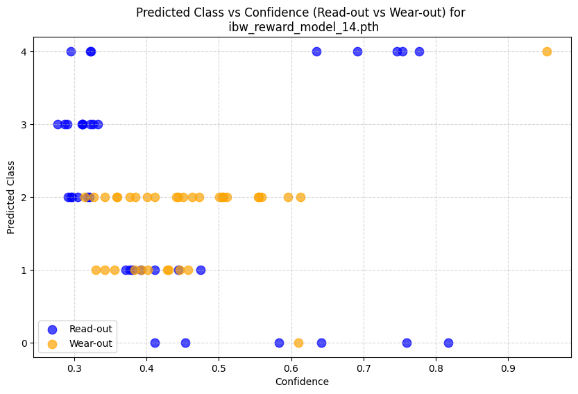
</p>

The model appears to be the **most confident when determining if the tip is new or damaged**, though it struggles with classification in the middle classes. A further discussion of this capability can be brought up to **use the uncertainty as a feature in order to warn the user about the tip condition**.

**AUC - ROC Curves**
<p align="center">
  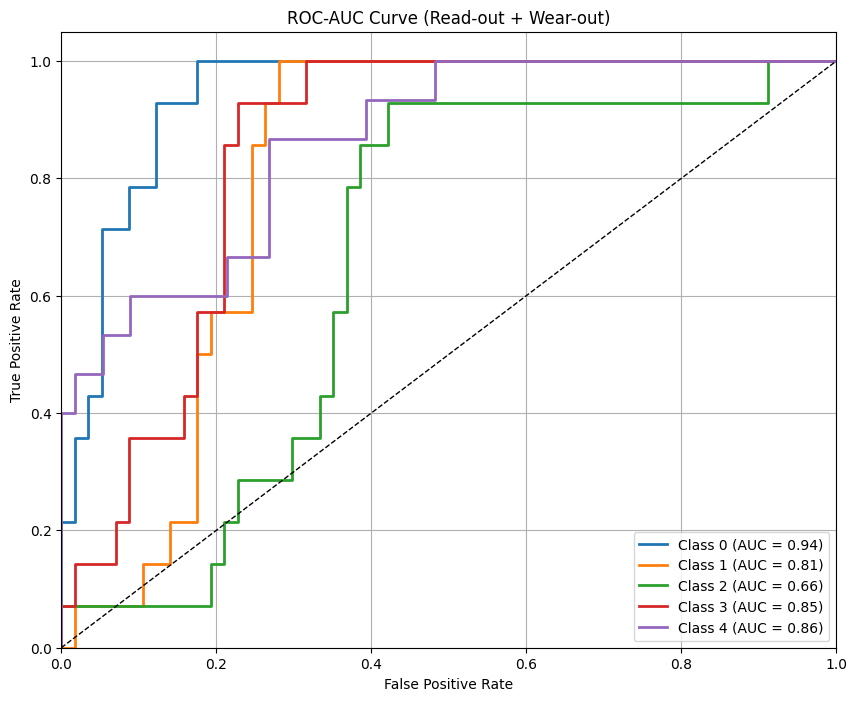
</p>

```
Per-Class AUC Scores:
  Class 0: 0.9436
  Class 1: 0.8083
  Class 2: 0.6579
  Class 3: 0.8459
  Class 4: 0.8631
```

The AUC - ROC curve above shows that the model is **rather successful in its classification** for all classes, but it **struggles with the middle classes**, as shown above.

The new-tip classification score is 0.94, and the last two classes have classification scores around 0.86.

**Confusion Matrix**
<p align="center">
  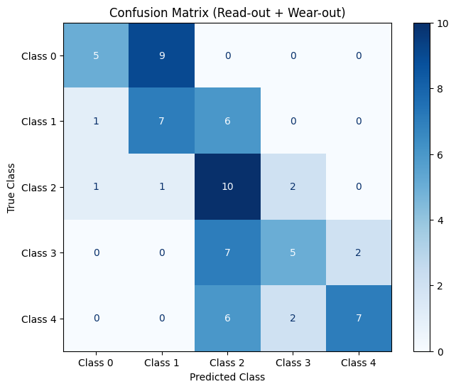
</p>

The confusion matrix has a clear linear trend, with many classifications at the start and finish being accurate. However, it appears as the tip becomes more damaged (i.e. classes 3-4), the model struggles to classify the tip as accurately.


#### Barlow Twins Approach
**Scan Index Versus Classification**
<p align="center">
  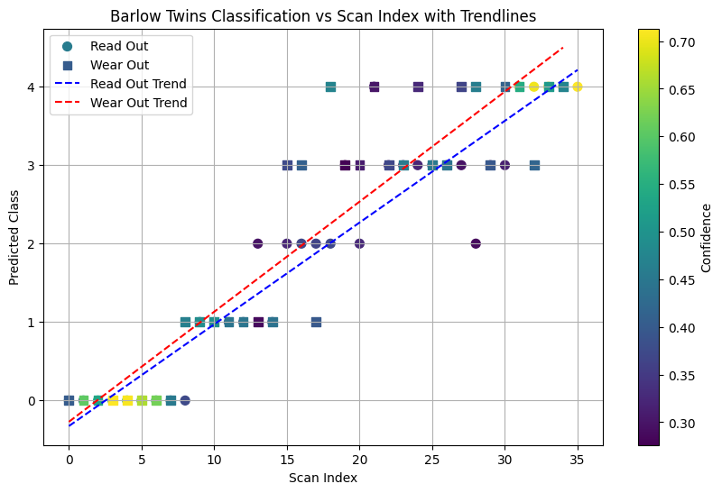
</p>

<p align="center">
  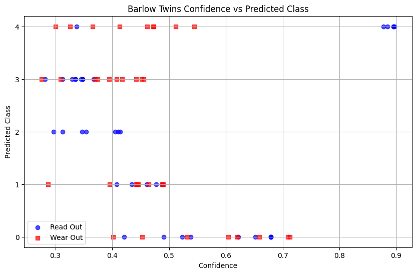
</p>

This model appears to have a successful, linear relaitonship between the scan index and its classification after training. This may indicate that the Barlow Twins approach benefited more from the smaller training set and more epochs, but we still observe the same trend if not worse about confidence values for each classification.

This model appears to **struggle to classify the middle classes, while being rather confident in its classification of the extreme classes (0 and 4)**.

**AUC - ROC Curves**
<p align="center">
  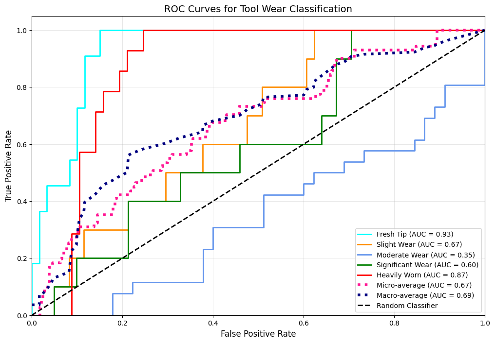
</p>

<p align="center">
  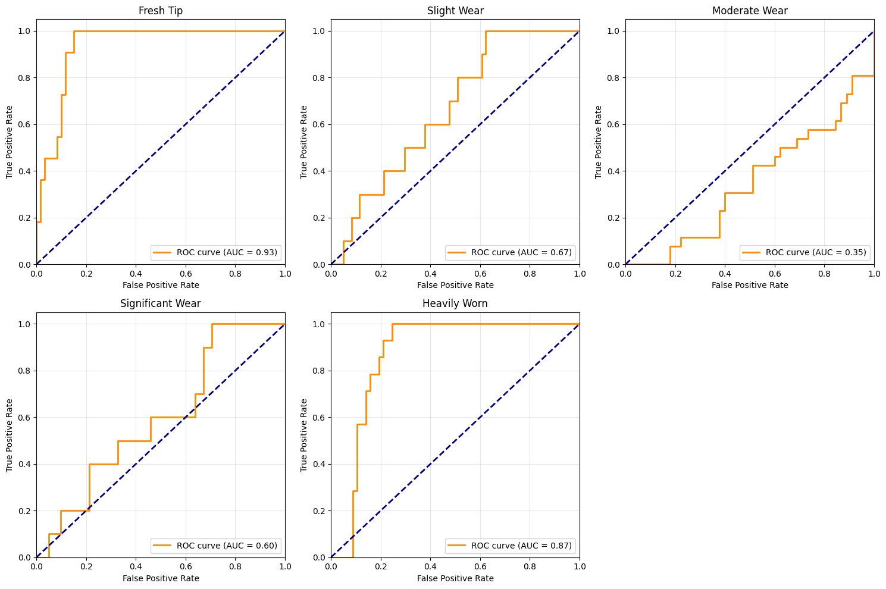
</p>

The curve here shows some interesting trend, and it relates to the incertainty shown in the above image. **The classifier is fairly good at making the correct choice for class 0 and class 4, but may perform worse than random for the middle classes.**

This brings us to consider the importance of the middle classes. If the model is *uncertain* about its classification in the middle, this could indicate some working interval of the tip condition. Perhaps the certainty of the model for tip damage (class 4) could be used as a progress indicator about the tip condition and an early warning about the tip failure.

**Confusion Matrix**
<p align="center">
  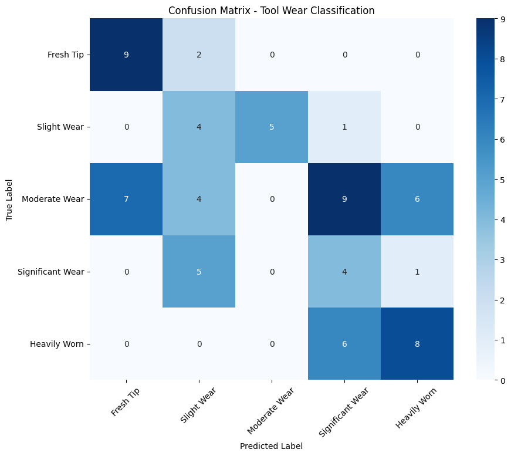
</p>

The confusion matrix shows a similar trend to the hybrid approach above. The model is fairly certain about classifications at the extremes, but appears to overclassify and underclassify images in the middle (hence why it is more uncertain).

### Usecase
These models were trained using 3x3 cropped and augmented images. The goal for this approach was to:
1. Allow the model to be trained on more samples, by splitting up the training data and augmenting images for the models to work with.
2. Allow the user to sample the AFM tip in real-time **without having to complete a full scan**. Hence, the user can feed up to 9 samples into the model at a time and get predictions about the status of the tip during runtime. **This can be used to stop the AFM in cases where the tip may be close to breaking (classes 2-3).**

Further improvements to the interface between these models and realtime data must be made, but for now the model has the capability for smaller samples of data to be used to predict the classification of the tip.


# Summary of Models and Workflow

## Experimental Procedure
The dataset used to train and evaluate models was collected from an AFM tip degradation experiment using a calibration sample. The AFM mode for this experiment was tapping mode. This sample consisted to two distinct regions:
+ Left side: a rough calibration surface used to accelerate tip wear in conjunction with decreased probe setpoint.
+ Right side: A regularly-patterned nanopillar array which was used to observe image quality over scan indices.
<p align="center">
  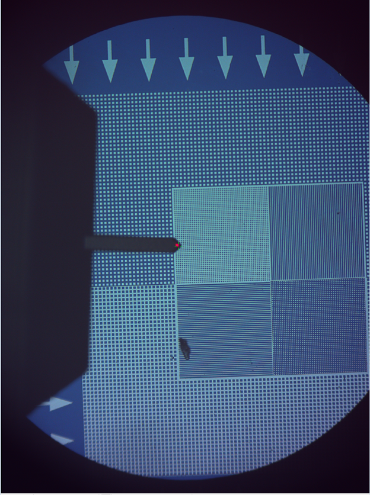
</p>
Probe view of the calibration sample with regions of interest under the tip pointer.


<p float="left">

  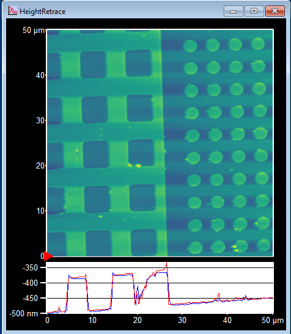
  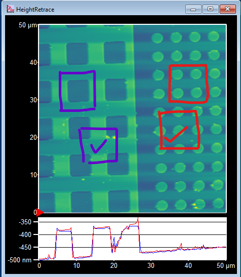
</p>

Appearance of two regions of interest (wear region left, read region right). The boxes with checks represent the area configured to generate the 256x256 100-square micrometer images for training.

The goal of this experiment is to systematically degrade the AFM tip by gradually reducing the setpoint, or by making the tip press closer to the surface during oscillation. The idea was to record the resulting effects on image quality over time for the same region on the sample, thus allowing the model to correlate image degradation patterns (especially in height and phase channels) with the gradual breakdown of the tip.

Independent analysis of the images is required until the tip is finally broken.

### Procedure
1. Sample:
+ An AFM calibration sample is used containing the two regions of interest (rough and nanopillar).
2. Trial Design:
+ Experiment is conducted until independent analysis confirms the tip has reached severe degradation. For this training set, the tip required 35 sequential trials with decreasing setpoint at a constant rate to achieve severe degradation.
3. Image Capture:
+ Each trial captures two AFM images, a wear-out image over the rough calibration surface with decreasing setpoint and a read-out image over the nanopillar region with constant setpoint.
4. Image Specifications:
+ Dimensions: 256x256 points/pixels.
+ Scan Size: 10 micrometers by 10 micrometers.
+ Channels: 8 channels, trace and retrace for height, amplitude, phase, and ZSensor.
+ Labeling: By index, equally divided into 5 groups.
+ Scan Rate: 2 Hz

### Sample Scans

<p align="center">
  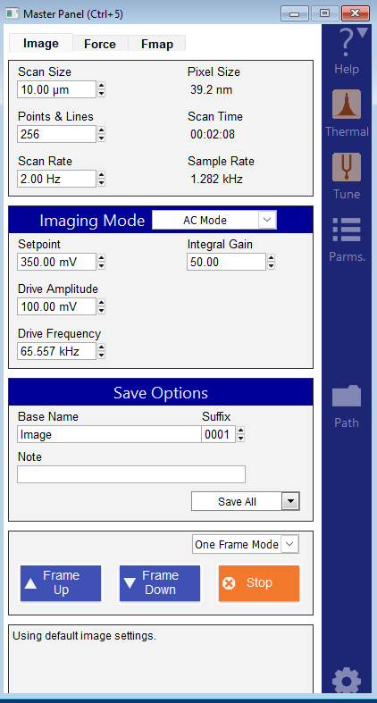
</p>
Scan information, with setpoint changing solely for wear-out images.

<p align="center">
  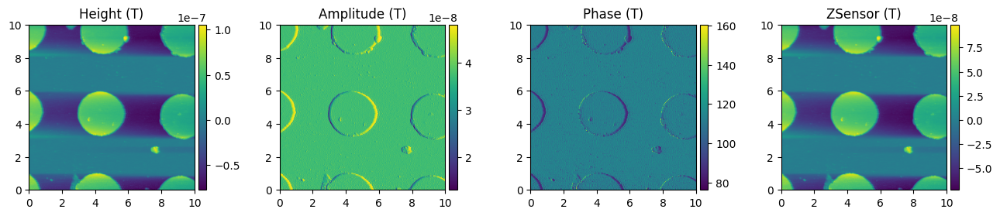
</p>

First read-out scan with brand new tip. The appearance of the nanopillars in the image are sharp and do not suffer from any rounding.

<p align="center">
  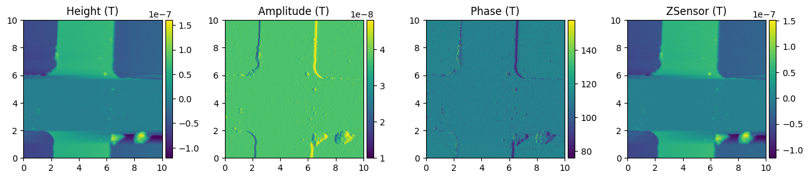
</p>

First wear-out scan with brand new tip. Though this image does not have many discernable features for the models to learn from, it will still be fed into training to indicate changes in the trace data.

<p align="center">
  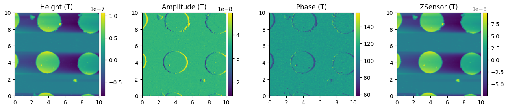
</p>

Read-out scan at index 17. Though there is not much change from the first image, trends in data may indicate that the tip is suffering some wear from this experiment.

<p align="center">
  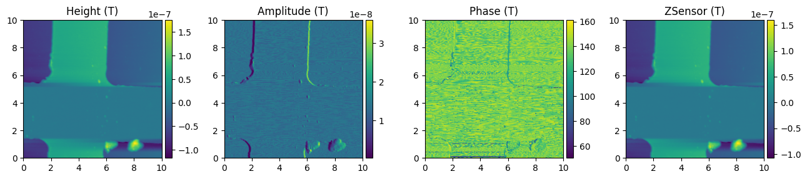
</p>

Wear-out scan at index 17. This follows the same trend from above, but it may be noticeable that there is some noise/alterations in the phase channel.

<p align="center">
  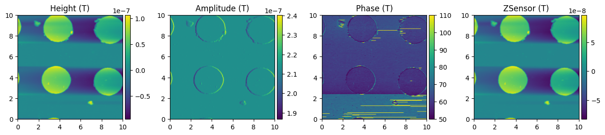
</p>

Read-out scan at final index 35. There is clear rounding in both the height and phase channels, as well as some artifacts in the phase channel itself. This is a clear indicator of tip failure as compared to previous images.

<p align="center">
  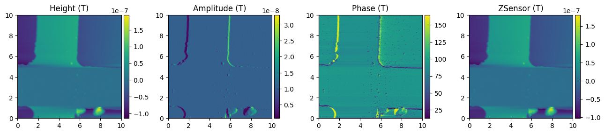
</p>

Wear-out scan at final index 34. The effects of tip degradation are observed in the artifacts appearing as horizontal lines across the scan, as well as the inconsistency with previous images.


## Barlow Twins Model
+ Model:  Barlow Twins (self-supervised contrastive learning)
+ Encoder:  Resnet without pre-training, set to be trained based on augmented images from experiment samples.
+ Augmentations:  The model is fed two views of cropped AFM images from the height channel, randomly rotated by 90 degrees to create contrasts. The height channel is converted into RGB by height magnitude.
+ Loss function:  `BarlowTwinsLoss` minimizes the redundancy between the embeddings of two views.
+ Feature Vector:   After the encoder is trained (about ~350 epochs to convergence), a projection head maps each image to a D-dimensional latent space, creating the feature vectors.

The feature vector for this model type is extracted during encoder training from the projection head's output. This maps the encoder's output to a D-dimensional space (around 2048-D). The projection head is used during training to minimize cross-correlation between the augmented images. After training, this projection head is removed and the encoder's output can be used for downstream classifier training.

## Hybrid Model
+ Model:  Pre-trained ResNet18 with ImageNetV1 weights.
+ Input: Multichannel AFM data (8 channels, height trace is taken and converted into RGB by height magnitude).
+ Feature Vector: Final-layer activations from the CNN backbone.
+ Classifier Head:  Softmax head on top of feature vector for multi-class prediction.

The feature vector for this model type is taken from the penultimate connected layer of the pre-trained ResNet18 CNN with ImageNetV1 weights. This output captures the spatial, textural, and other features from the AFM height channel trace data.

The feature vector created (around 512-D for this model of ResNet18) is then fed into a classifier head (5 classes) to be used for prediction later in the pipeline.

## Feature Vector Design
+ Chose the encoder type (ResNet in the case of the hybrid model, projection head from Barlow Twins).
+ Controlled the data preprocessing and augmentation strategy (random augmentation for Barlow Twins, cropping and image augmentation of height channel for hybrid model).
+ Using domain knowledge on AFM data, reward trends, and the scan index to guide the model to extract relevant features from the datasets.
+ Combined classification and reward-based losses to affect which features each model learns.

These are high-dimensional embeddings from AFM images, created via self-supervised encoder architectures (either Barlow twins or this hybrid approach). The structure is guided by domain-specific augmentation of images, physics-based reward functions from real trends.

Though this encoder is a NN with many internal layers, it has been designed with this training pipeline through the chosen architecture and supervision. So, the feature space of the encoder after the training pipeline reflects the AFM scanning quality and physical trends from trace data. Downstream classifiers and decision systems can work with these embeddings.


## Target Design
+ Interprets the scan index to define the 5 classes of quality (0-4).
+ Uses the reward function defined above as a soft target, enforcing the relationship between image-based learning from the height channel and real data trends.

These targets are defined based on the experimental metadata and scan indices, which map the scan examples into five categories which represent the gradual degradation of the tip. Incorporating a domain-specific reward function adds supervision to training and penalizes deviation from scan trends, allowing the model to learn beyond label or classification accuracy with physical qualities as well.