# ofdspm
## Outlier/Failure Detector for Scanning Probe Microscopes at the Image Level
This is a working repository to find a solution to indicating when the tip of an Scanning Probe Microscope (SPM) becomes damaged or dulled to the point where the images are no longer accurate.

With reference to the `aespm library`, this repository explores ways to develop algorithms to detect "bad" images either as a result of statistical anomalies or from machine learning.
+ Refer to the Jupyter notebook `primitive_models/simulator.ipynb` for this exploration.
+ Refer to the models designed for this problem in `hybrid_model.ipynb` and `barlow_twins.ipynb` for a further exploration about classifying the wear of the tip.

## Introduction
So, the goal for this project is to **find a way to classify the status of the AFM tip, and to potentially indicate the causes for its degradation**. Through the course of this project's development, several approaches have been taken to study and design models that **perform well and sufficiently fast enough to be used in real time**.
+ Applications to use this in real time will be expanded on later, but currently the **model accepts up to 86x86 images** with trace/retrace data to make a single prediction.
+ The prediction algorithm from a Hybrid model averages the prediction amongst all augments (72x).

Effects of this damage occur in that the images become **rounded (or less sharp), and the tip is prone to other issues such as double-tip effects** and improper material data being received.
+ The experiments ran to gather data focused on purposefully dulling the tip to the point where the sample's features became rounded. 
+ Though there may not be tip breakage from these experiments, it is worth noting that image-based Convolutional Neural Networks such as the one used in this project have been proven to be excellent at detecting anomalies like this.

For reference, "good" images do not have tip failures from the SPM. These images are given below:
<p float="left">
  
  
</p>

"Bad images" with anomalies like horizontal lines are given as examples below.
<p float="left">
  
  
</p>

Though the anomalies present above are common when the tip is completely broken, often the problem with extended use on a SPM is that the tip becomes rounded. Examples of this rounding are given below:

<p float="left">
  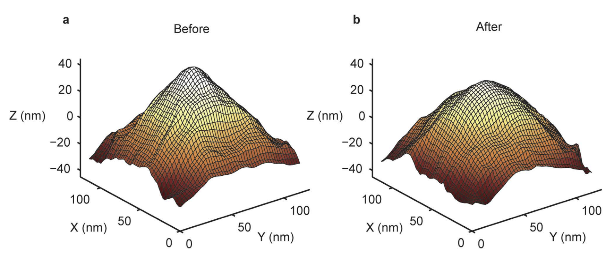
</p>

Image above is sourced from **Vorselen, Daan & Kooreman, Ernst & Wuite, Gijs & Roos, Wouter. (2016). Controlled tip wear on high roughness surfaces yields gradual broadening and rounding of cantilever tips. Scientific Reports. 6. 36972. 10.1038/srep36972.**

Tip rounding will, in general, make sharp features appear rounded. This is due to the tip not having enough resolution to measure features on the surface of the sample with much precision.

<p float="left">
  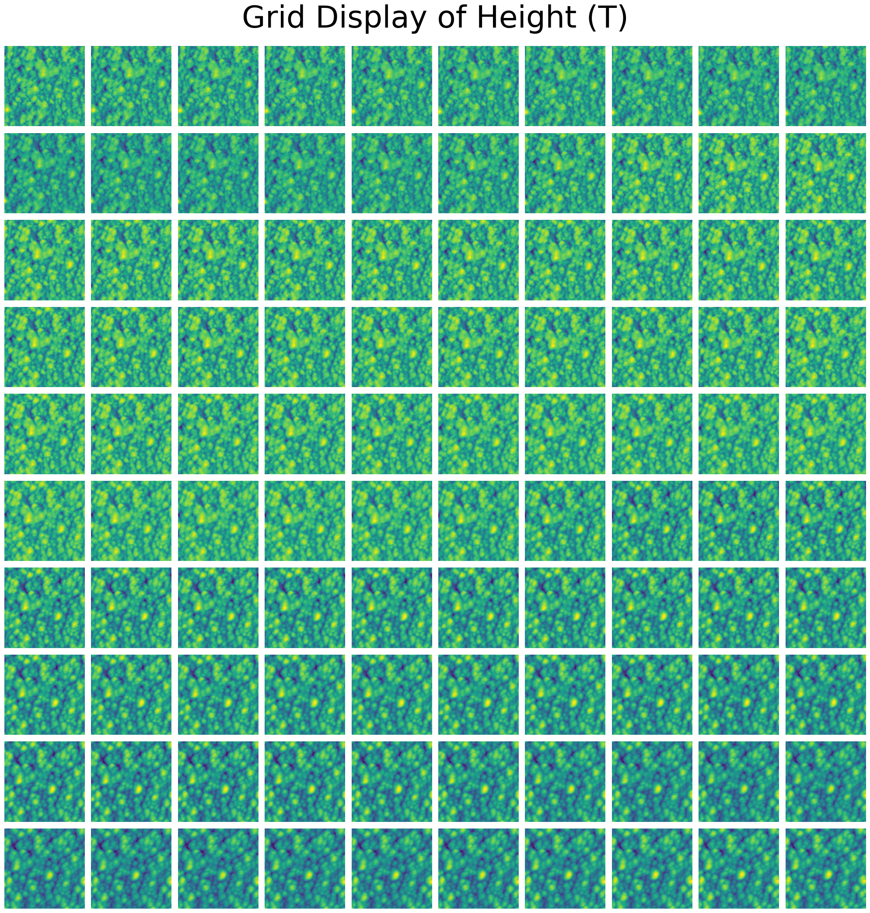
</p>

The above grid is from an experiment where the set point was gradually decreased along columns (bringing the tip closer to the sample), and the drive amplitude was increased along rows. The top left represents a brand-new tip, while the bottom-right shows the tip has been rounded due to the lack of feature definition.

The model created for this project will use trends from data and the actual image appearance (height channel, trace only) to solve a classification problem.

## Files
+ `barlow_twins.ipynb`: Contains the training for the Barlow Twins encoder based off dual augmentations of sample data as well as a classifier head (either using rewards, not recommended). **This model has been shown through experimentation to suffer from oversimplification of the feature space, but still could be applied well into a binary classifier.**
+ `examples.ipynb`: Notebook where training and evaluation for **both Hybrid and Barlow Twins models** can be done. This notebook uses code from the `tools.py` utility module.
  + Features:
    + Distribution of model classification by scan index (should be linear).
    + Confidence distribution by scan index.
    + AUC - ROC analysis and confusion matrix generation.
    + PCA analysis (configurable for # of components.)
    + Variance analysis of features and graphing.
    + Live training displays with combined losses and validation scores.
+ `exp1.ipynb`: Notebook containing the exploration of the data from the first (preliminary experiment. This may be removed in future updates as the code has been transferred to `tools.py` as utilities.)
+ `exp2.ipynb`: A notebook that explores the grid experiment and for gathering information about models' feature spaces during training.
+ `hybrid_model.ipynb`: Notebook where training and evaluation for the hybrid model were explored. This may be removed in future updates as it has been deprecated or pushed to `tools.py`.
+ `tools.py`: Main utility module. Most notebooks import functions. Though the module is fairly commented, it is important to reference each function and class as organized.

# Primitive Models Using Purely Data Trends

## Methodology
The method by which a ML algorithm is trained and tested for several source files varies by the type of model created. For real images, a RandomForestClassifier model is chosen for its experimental accuracy and ease. For synthesized images, the XGBooostClassifier algorithm is used instead.

The method by which data is taken from the `.ibw` files and converted into **pandas DataFrames** is through means of the `aespm library`'s tools to manage, view, and store values from these files.

Since some of the source files contain different channels of information, this repository elected to grab the four most common channels and train the ML model on those:
+ Height
+ Amplitude
+ Phase
+ ZSensor

These channels also may contain **trace and retrace** data, which **we hypothesize can be used to indicate the status of the tip** since the discrepancies between trace and retrace have been shown to be worse when the tip is damaged or broken.

The images used for advanced model training exist as 256-by-256-point DataFrames with eight channels per point. These images come from deliberate experiments to give the models sufficient wear gradients to learn the differences between good and bad tips. 

## Low-Level Machine Learning Models
### Description
These models below represent the first development toward building at tip status classifier. **Though they are rather primitive and purely data-based, they still provide some good classification accuracy**. Refer to the description of the models below:

### Training a RandomForestClassifier Model
The effectiveness of the current ML model is limited by the sorted data set. Currently, there are **58 good images and 14 bad images**. This is not nearly enough and introduces bias to the training set. Using the standard 80/20% split, the ML model is excellent at finding good images, but suffers at finding bad images.

A sample output from `test.py` is given below:
```
=== TRAINING ML MODEL (MATCHED TO PREDICTION) ===
Target channels: ['Height', 'Amplitude', 'Phase', 'ZSensor']
Expected features: 4 channels * 4 stats + 6 pairs = 22
Found 58 good image files
Found 14 bad image files
Feature names (22): ['Amplitude_std', 'Amplitude_range', 'Amplitude_entropy', 'Amplitude_skew', 'Height_std', 'Height_range', 'Height_entropy', 'Height_skew', 'Phase_std', 'Phase_range', 'Phase_entropy', 'Phase_skew', 'ZSensor_std', 'ZSensor_range', 'ZSensor_entropy', 'ZSensor_skew', 'Amplitude_Height_residual', 'Amplitude_Phase_residual', 'Amplitude_ZSensor_residual', 'Height_Phase_residual', 'Height_ZSensor_residual', 'Phase_ZSensor_residual']
Successfully processed 58 good images
Successfully processed 14 bad images
Final training data: 72 samples, 22 features
Good images: 58, Bad images: 14
Training accuracy: 1.000
Test accuracy: 1.000
Cross-validation score: 0.876 (+/- 0.094)
```

Since this output contains a lot of clutter, it is important to note that **this program only considers the classification output of the ML model, labeled `ML failure`**. Other sample statistics are placed for debugging and observational purposes only. Though there is significant impact from the good images about thresholds (they impact the weights of the training columns), in reality they do not change between runs or changes between files.

**To improve or modify the ML source files**, more files must be added to the `sorted_data/` directory in this repo.

## Sample Outputs and Analysis
This section will contain some sample images/outputs from the ML training and how they relate to whether or not the model has been trained well.

### Bad Images
The ML model is trained with the same set (although random training/testing set), so we can expect it to behave relatively the same per run.

The bad images (3) chosen for this test run are shown below with their paths.

#### Bad Image 1
Path: `sorted_data/bad_images/PositionC_30Cs70M0000.ibw`
<p float="left">
  
  
</p>
<p float="left">
  
  
</p>

The following is the output from the `test.py` training with this filepath given (truncated):
```
=== TRAINING ML MODEL (MATCHED TO PREDICTION) ===
Target channels: ['Height', 'Amplitude', 'Phase', 'ZSensor']
Expected features: 4 channels * 4 stats + 6 pairs = 22
Found 58 good image files
Found 14 bad image files
Feature names (22): ['Amplitude_std', 'Amplitude_range', 'Amplitude_entropy', 'Amplitude_skew', 'Height_std', 'Height_range', 'Height_entropy', 'Height_skew', 'Phase_std', 'Phase_range', 'Phase_entropy', 'Phase_skew', 'ZSensor_std', 'ZSensor_range', 'ZSensor_entropy', 'ZSensor_skew', 'Amplitude_Height_residual', 'Amplitude_Phase_residual', 'Amplitude_ZSensor_residual', 'Height_Phase_residual', 'Height_ZSensor_residual', 'Phase_ZSensor_residual']
Successfully processed 58 good images
Successfully processed 14 bad images
Final training data: 72 samples, 22 features
Good images: 58, Bad images: 14
Training accuracy: 1.000
Test accuracy: 1.000
Cross-validation score: 0.876 (+/- 0.094)

Top 10 Most Important Features:
            feature  importance
0     Amplitude_std    0.132955
7       Height_skew    0.127915
11       Phase_skew    0.094534
8         Phase_std    0.085190
4        Height_std    0.084544
3    Amplitude_skew    0.081063
15     ZSensor_skew    0.065603
1   Amplitude_range    0.043449
9       Phase_range    0.039667
13    ZSensor_range    0.033934
Model saved as 'RandomForest_model.pkl'
Size of data (rows): 118
Current mode: AC Mode
Channels: ['Height', 'Amplitude', 'Phase', 'ZSensor']
Size (meters): 3e-05
ML feature vector shape: (1, 22)
Expected features: 4 channels * 4 stats + 6 residuals = 22
=== ENHANCED FAILURE ANALYSIS ===
Traditional failure: False (score: 0 of 0)
Multiple entropy failure: True (score: 4 flags of 4)
High proximity failure: False (score: 0.662)
ML failure: True (probability: 0.680)
OVERALL FAILURE: False
```

#### Analysis
The ML is fairly confident with detecting good images. This is likely explained by the current testing set, because most of the images given are "good images."

What is considered "good" versus "bad" is still arbitrarily set with various thresholds in order to make training sets. This points us at finding special metrics to identify possible failures in the tip in real time.

Alternatively, we can explore using **self supervision** to drive these models to train based on what the ground-truth classification *should be*.

# Advanced Models Using Image Detection and Data

## Self-Supervised Image Detection Models
This section focuses on improving both the accuracy and real-time capabilities of this project in that we will use real experimental data to train either pre-trained CNNs or develop an encoder based on augmented images from the experiment.

The experiment ran included purposefully damaging the tip by gradually decreasing the setpoint so that the tip endures more pressure. The intent is that the data will reflect the changes in the tip to the extent that some classifier model can understand the relationship between visual image quality and the relationships with data.


# Summary of Models and Workflow

## Experimental Procedure
The dataset used to train and evaluate models was collected from an AFM tip degradation experiment using a calibration sample. The AFM mode for this experiment was tapping mode. This sample consisted to two distinct regions:
+ Left side: a rough calibration surface used to accelerate tip wear in conjunction with decreased probe setpoint.
+ Right side: A regularly-patterned nanopillar array which was used to observe image quality over scan indices.
<p align="center">
  
</p>
Probe view of the calibration sample with regions of interest under the tip pointer.


<p float="left">

  
  
</p>

Appearance of two regions of interest (wear region left, read region right). The boxes with checks represent the area configured to generate the 256x256 100-square micrometer images for training.

The goal of this experiment is to systematically degrade the AFM tip by gradually reducing the setpoint, or by making the tip press closer to the surface during oscillation. The idea was to record the resulting effects on image quality over time for the same region on the sample, thus allowing the model to correlate image degradation patterns (especially in height and phase channels) with the gradual breakdown of the tip.

Independent analysis of the images is required until the tip is finally broken.

### Procedure
1. Sample:
    + An AFM calibration sample is used containing the two regions of interest (rough and nanopillar).
2. Trial Design:
    + Experiment is conducted until independent analysis confirms the tip has reached severe degradation. For this training set, the tip required 35 sequential trials with decreasing setpoint at a constant rate to achieve severe degradation.
3. Image Capture:
    + Each trial captures two AFM images, a wear-out image over the rough calibration surface with decreasing setpoint and a read-out image over the nanopillar region with constant setpoint.
4. Image Specifications:
    + **Dimensions**: 256x256 points/pixels.
    + **Scan Size**: 10 micrometers by 10 micrometers.
    + **Channels**: 8 channels, trace and retrace for height, amplitude, phase, and ZSensor.
    + **Labeling**: By index, equally divided into 5 groups.
    + **Scan Rate**: 2 Hz

### Sample Scans

<p align="center">
  
</p>
Scan information, with setpoint changing solely for wear-out images.

<p align="center">
  
</p>

**First read-out scan with brand new tip**. The appearance of the nanopillars in the image are sharp and do not suffer from any rounding.

<p align="center">
  
</p>

**First wear-out scan with brand new tip**. Though this image does not have many discernable features for the models to learn from, it will still be fed into training to indicate changes in the trace data.

<p align="center">
  
</p>

**Read-out scan at index 17**. Though there is not much change from the first image, trends in data may indicate that the tip is suffering some wear from this experiment.

<p align="center">
  
</p>

**Wear-out scan at index 17**. This follows the same trend from above, but it may be noticeable that there is some noise/alterations in the phase channel.

<p align="center">
  
</p>

**Read-out scan at final index 35**. There is clear rounding in both the height and phase channels, as well as some artifacts in the phase channel itself. This is a clear indicator of tip failure as compared to previous images.

<p align="center">
  
</p>

**Wear-out scan at final index 34**. The effects of tip degradation are observed in the artifacts appearing as horizontal lines across the scan, as well as the inconsistency with previous images.

 Categories for Classification
| Class Index | Description               |
|-------------|---------------------------|
| 0           | Pristine / new            |
| 1           | Slight degradation        |
| 2           | Moderate degradation      |
| 3           | Severe degradation        |
| 4           | Tip broken                |


## Barlow Twins Model
+ **Model**:  Barlow Twins (self-supervised contrastive learning)
+ **Encoder**:  Resnet without pre-training, set to be trained based on augmented images from experiment samples.
+ **Augmentations**:  The model is fed two views of cropped AFM images from the height channel, randomly rotated by 90 degrees to create contrasts. The height channel is converted into RGB by height magnitude.
+ **Loss function**:  `BarlowTwinsLoss` minimizes the redundancy between the embeddings of two views.
+ **Feature Vector**:   After the encoder is trained (about ~350 epochs to convergence), a projection head maps each image to a D-dimensional latent space, creating the feature vectors.

The feature vector for this model type is extracted during encoder training from the projection head's output. This maps the encoder's output to a D-dimensional space (around 2048-D). The projection head is used during training to minimize cross-correlation between the augmented images. After training, this projection head is removed and the encoder's output can be used for downstream classifier training.

## Hybrid Model
+ **Model**:  Pre-trained ResNet18 with ImageNetV1 weights.
+ **Input**: Multichannel AFM data (8 channels, height trace is taken and converted into RGB by height magnitude).
+ **Feature Vector**: Final-layer activations from the CNN backbone.
+ **Classifier Head**:  Softmax head on top of feature vector for multi-class prediction.

The feature vector for this model type is taken from the penultimate connected layer of the pre-trained ResNet18 CNN with ImageNetV1 weights. This output captures the spatial, textural, and other features from the AFM height channel trace data.

The feature vector created (around 512-D for this model of ResNet18) is then fed into a classifier head (5 classes) to be used for prediction later in the pipeline.

## Feature Vector Design
+ Chose the **encoder type** (ResNet in the case of the hybrid model, projection head from Barlow Twins).
+ Controlled the **data preprocessing and augmentation strategy** (random augmentation for Barlow Twins, cropping and image augmentation of height channel for hybrid model).
+ Using **domain knowledge on AFM data, reward trends, and the scan index** to guide the model to extract relevant features from the datasets.
+ **Combined classification and reward-based losses** to affect which features each model learns.

The following table summarizes the learned feature representations used by the two models:

| Model           | Input Type            | Feature Vector Dimension | Feature Source                |
|----------------|------------------------|---------------------------|-------------------------------|
| Barlow Twins   | 256×256 AFM crops      | 2048                      | Self-supervised ResNet18 encoder |
| Hybrid ResNet  | 256×256 AFM crops      | 512                       | Penultimate layer of pretrained ResNet18 |

Both models operate on 3×3 non-overlapping crops (9 per image), resized to 256×256 pixels. These crops are used to form individual examples for classification.


These are **high-dimensional embeddings from AFM images, created via self-supervised encoder architectures (either Barlow twins or this hybrid approach)**. The structure is guided by domain-specific augmentation of images, physics-based reward functions from real trends.

Though this encoder is a NN with many internal layers, it has been designed with this training pipeline through the chosen architecture and supervision. So, the **feature space of the encoder after the training pipeline reflects the AFM scanning quality and physical trends from trace data**. Downstream classifiers and decision systems can work with these embeddings.


## Target Design
+ Interprets the scan index to define the 5 classes of quality (0-4).
+ Uses the reward function defined above as a soft target, enforcing the relationship between image-based learning from the height channel and real data trends.

These targets are defined based on the experimental metadata and scan indices, which map the scan examples into five categories which represent the gradual degradation of the tip. Incorporating a domain-specific reward function adds supervision to training and penalizes deviation from scan trends, allowing the model to learn beyond label or classification accuracy with physical qualities as well.


| Component        | Features                                | Target Labels                         |
|------------------|------------------------------------------|----------------------------------------|
| Barlow Twins     | 2048-D self-supervised embedding         | 5-class or binary degradation label    |
| Hybrid ResNet    | 512-D pretrained ResNet18 features       | 5-class or binary degradation label    |
| Combined Model (hypothesized)   | 2560-D concatenated vector               | Final class prediction                 |

Targets:
- 5-class ordinal scale (0 to 4)
- Binary collapse (good vs. bad)
- Optional detection of high-uncertainty crops for failure prediction

## Test Dataset Formation and Evaluation Strategy
All models are evaluated using an 80/20 random split (80% of data for training, 20% for testing) over each epoch of training.

The augmentation strategy is different for each model:
1. **Barlow Twins**:  Image augmentation is done while training the encoder and during training, but this model only uses one of 3x3 cropped images from the original. Augmentation in the same manner occurs during testing as well.
    + It is important to note that the augmentation for the Barlow Twins encoder and classifier training is NOT the same as the hybrid model. The reason that only 9 crops are made per images is because the Barlow twins encoder benefits from smaller datasets.
    + As a design choice, the size of the dataset used to train the Barlow twins from experimental data was limited as to not overload the encoder during training. Though the encoder reached convergence after about ~350 epochs, it could have been overtrained.
2. **Hybrid Model**:  Image augmentation is done during training and testing, but it is different from the Barlow Twins approach. Images are augmented in the following way:
    + **3x3 crop**: From the original 256x256 image, 9 total images are created from a grid (no overlap).
    + **Rotation**: All cropped images are rotated 4 times by 90 degrees (4 new images per 9 images). This brings the total images per original to 36.
    + **Horizontal Flipping**: Each image is then flipped horizontally, effectively doubling the total images to 72 images per original.
    + For a trial of 71 images, this augmentation will result in **5112 images to train on**.

  
### Barlow Twins Model


### Hybrid Model
- Input: Same 256×256 crops.
- Feature extraction: Use pretrained ResNet18 to extract 512-dimensional vectors.
- Supervised training: Train classifiers on extracted features using degradation labels.
- Classifiers used: Logistic regression, shallow MLP, decision trees.


### Methodology
Two models will be trained and analyzed based on specific design criteria. The models will be fed images (raw, RGB image data, cropped and/or augmneted), to train on feature detection. A reward-based, minimization of loss training program will be run on these problems to use a physics-based reward function derived and weighted exeprimentally.


#### **Reward Function**
+ **Height Consistency** (Trace vs Retrace) - MAE between two values
+ **Phase Consistency** (Trace vs Retrace) - MSE between values
+ **Image Sharpness/Focus** (using gradient variance, for the CNN's image training)
+ **Signal-to-Noise Ratio of Height** (SNR, for the CNN's features training)
+ **Data Quality** (check for artifacts, clips, or excess saturation)
+ **Scan Index Penalty** (prefer earlier scans, indicating tip quality based on experiment)
+ **Scan Rate Appropriateness** (if outside of the set range of 2Hz)

```
weights = {
        'height_consistency': 0.25,
        'phase_consistency': 0.25, 
        'sharpness': 0.15,
        'snr': 0.15,
        'data_diversity': 0.1,
        'tip_freshness': 0.08,
        'scan_rate': 0.02
}

    # Weighted combination
    total_reward = sum(weights[key] * rewards[key] for key in weights.keys())
    
    return total_reward, rewards  # `rewards` is the dictionary of components
```

This reward function is used in both models to guide the training of a 5-class multiclass classifier model to **predict the gradual status of the tip**.

#### Experiment Procedure
The procedure of this experiment was to create arbitrary classes of tip damage based on the scan index. The goal for this is to create some observable trend between "new" tips and "broken" tips by classifying even groups of scans in order from the first scan on a new tip to the last. The classifiers built from these images will then need to be able to identify which group, or what condition, the current image is in.

The intent for this is that a smaller, sample image (86x86), can be **fed into the model during machine runtime**, which will allow the user to receive classifier information about the predicted status of the tip based on its training. This may be important to either **identify causes for failure or prevent tip failure in the current scan in real time**.

#### **Model Types**
1. **ResNet18 with ImageNetV1 weights (pretrained CNN)**. A classifier is built using these weights but the CNN is encouraged to focus on images it is not sure on depending on the reward calculated per image augment.
+ This model combines both image training (fault detection and edge detection) with a hybrid approach of self-supervised learning from loss minimization of both classification loss *and* reward loss. The goal for this hybridized approach was to allow the image-based model to train on real data and the appearance of the image (height channel), as to build some relationship with image data based on reward calculations.
2. **Barlow Twins encoder** created from augmented (cropped, rotated) image data. A classifier is built on top of this encoder for the same classes as the pretrained CNN above.
+ This model combines the Barlow Twins approach for finding discrepancies between pairs of augmented images (height channel) and real data from the experiment to reinforce trends that may indicate the tip's condition.

Both models were fed cropped images (3x3 crops from the original 256x256-point image), which will be important later for the discussion of usecases.

#### Training Data
Both models were trained locally using hardware acceleration (CUDA/MPS), of which the number of epochs and reinforcement are:
1. **Pretrained CNN/Hybrid Model**: 4 epochs (ran into performance issues), with 5112 samples from augmented data from 71 files (72 times augmentation ratio). Training/validation batches were 256/64.
    - Input: Cropped and augmented AFM images (rotations, flips).
    - Feature extraction: Use pretrained ResNet18 to extract 512-dimensional vectors.
    - Supervised training: Train classifiers on extracted features using degradation labels.
    - Classifiers used: Logistic regression, shallow MLP, decision trees.

2. **Barlow Twins**: ~350 epochs to convergence for decoder. Classifier was trained to about ~400 epochs until reaching near-convergence at 60% accuracy.
    - Input: Same 256×256 crops.
    - Dataset: 71 original AFM images → 639 total base crops (3×3).
    - Augmentation: ~72× augmentation, resulting in ~5100 total training examples.
    - Learning objective: Maximize similarity between different augmentations of the same crop.
    - Labels: Not used during Barlow Twins training; applied afterward for classification using the learned embeddings.

Both models were trained with the same experimental dataset of 71 images (36 read-out images, 35 wear-out images.)

### Analysis and Comparison
After training, the models were put through similar analysis as mutliclass classifiers. The following trends and images describe both their accuracy as well as their performance.

#### Pretrained CNN (Hybrid Model)
**Scan Index Versus Classification**
<p align="center">
  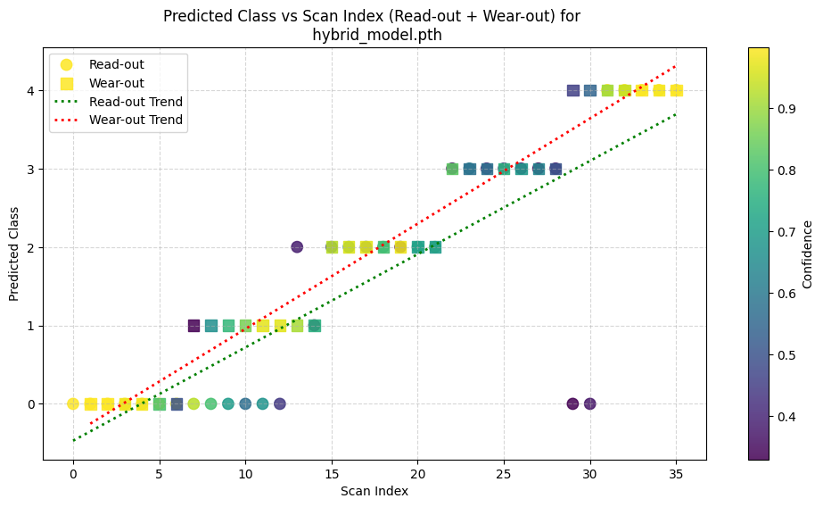
</p>

<p align="center">
  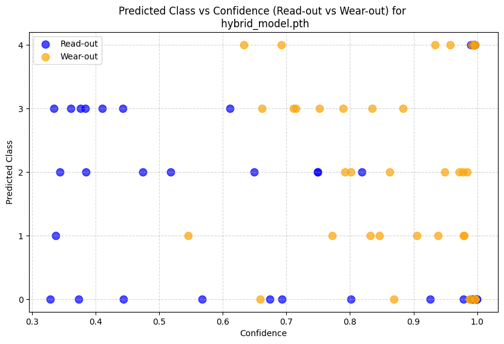
</p>

The model appears to be the **most confident when determining if the tip is new or damaged**, though it struggles with classification in the middle classes. A further discussion of this capability can be brought up to **use the uncertainty as a feature in order to warn the user about the tip condition**.

**AUC - ROC Curves**
<p align="center">
  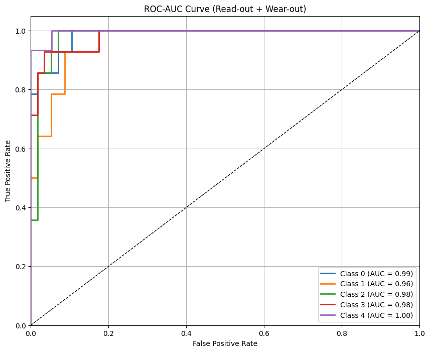
</p>


The AUC - ROC curve above shows that the model is **rather successful in its classification** for all classes, but it **struggles with the middle classes**, as shown above.


**Confusion Matrix**
<p align="center">
  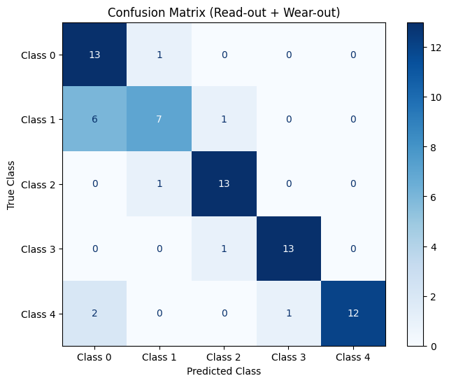
</p>

The confusion matrix has a clear linear trend, with many classifications at the start and finish being accurate. However, it appears as the tip becomes more damaged (i.e. classes 3-4), the model struggles to classify the tip as accurately.


#### Barlow Twins Approach
**Scan Index Versus Classification**
<p align="center">
  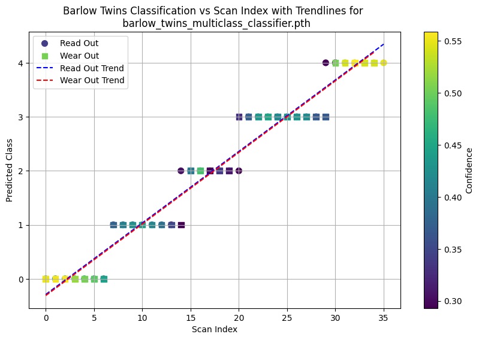
</p>

<p align="center">
  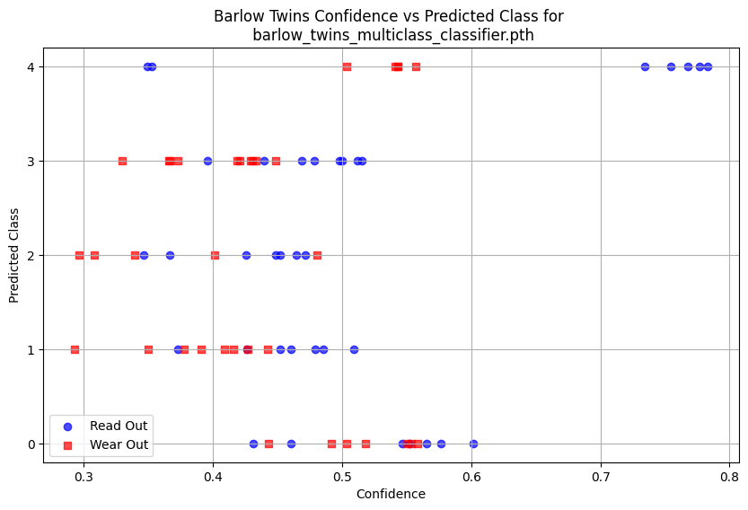
</p>

This model appears to have a successful, linear relaitonship between the scan index and its classification after training. This may indicate that the Barlow Twins approach benefited more from the smaller training set and more epochs, but we still observe the same trend if not worse about confidence values for each classification.

This model appears to **struggle to classify the middle classes, while being rather confident in its classification of the extreme classes (0 and 4)**.

**AUC - ROC Curves**
<p align="center">
  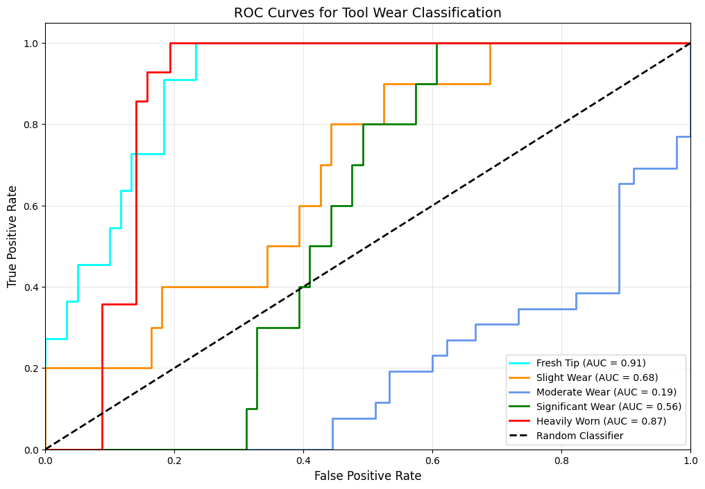
</p>

<p align="center">
  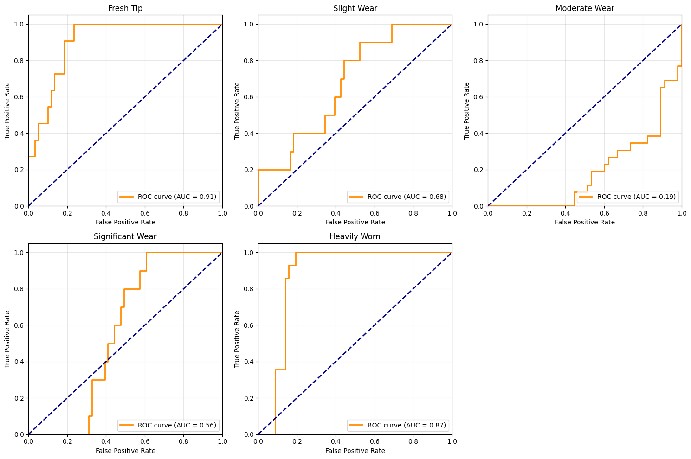
</p>

The curve here shows some interesting trend, and it relates to the incertainty shown in the above image. **The classifier is fairly good at making the correct choice for class 0 and class 4, but may perform worse than random for the middle classes.**

This brings us to consider the importance of the middle classes. If the model is *uncertain* about its classification in the middle, this could indicate some working interval of the tip condition. Perhaps the certainty of the model for tip damage (class 4) could be used as a progress indicator about the tip condition and an early warning about the tip failure.

**Confusion Matrix**
<p align="center">
  
</p>

The confusion matrix shows a similar trend to the hybrid approach above. The model is fairly certain about classifications at the extremes, but appears to overclassify and underclassify images in the middle (hence why it is more uncertain).

## PCA Analysis and Model Comparison
To show that the designed hybrid model architecture is superior to the Barlow Twins model for this classification problem, we can conduct some PCA analysis of the features the models learn.

This functionality has been added to the `examples.ipynb` notebook for use for both the hybrid model and the Barlow Twins model.

The following images and analysis demonstrate that the hybrid model is both well-designed and the best fit for this problem.

```
Hybrid Model:
  Feature dimension: 512
  Number of samples: 1023
  PC1 explains: 18.08% of variance
  PC1+PC2 explains: 33.05% of variance
  First 5 PCs explain: 66.30% of variance
  Class distribution: {0: 209, 1: 216, 2: 200, 3: 201, 4: 197}

Barlow_Twins Model:
  Feature dimension: 512
  Number of samples: 1023
  PC1 explains: 52.32% of variance
  PC1+PC2 explains: 58.04% of variance
  First 5 PCs explain: 68.03% of variance
  Class distribution: {0: 209, 1: 216, 2: 200, 3: 201, 4: 197}
```

<p align="center">
  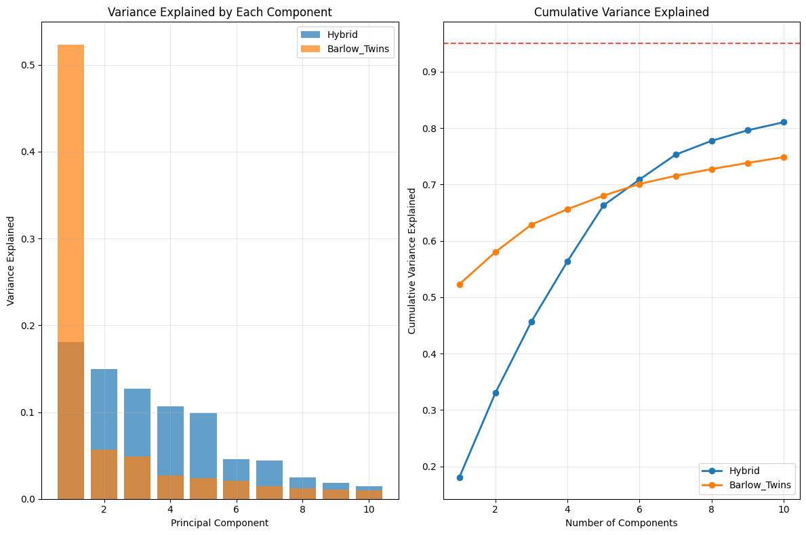
</p>

The representation collapse of the Barlow Twins model is apparent form the variance charts. The model appears to have oversimplified the feature space, resulting with **PC1 capturing more than half of the variance**. The hybrid model's PC1 only captures around 18% of the variance for this example, which is much more acceptable.

<p align="center">
  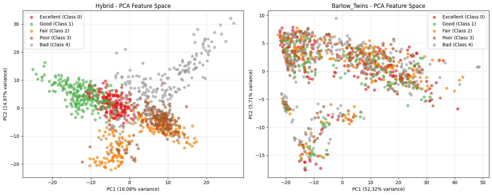
</p>

The **defined clusters for the hybrid model** show that the model is learning to distinguish classes very well, while the Barlow Twins model does not have this separation between PC1 and PC2. **The lack of separation therein likely points to the lack of certainty and accuracy in the Barlow Twins model.**

<p align="center">
  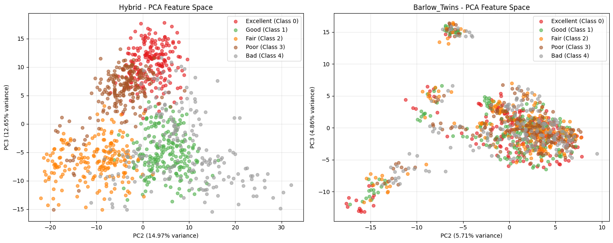
</p>

The comparison of **PC2 and PC3 feature spaces** also shows that the hybrid model is successful at learning differences between features, while the Barlow Twins model struggles to solve the multiclass problem. This points us to believe that the **Barlow Twins method employed in this project is instilling a multiclass classifier on top of a binary classifier** (a pitfall of the contrastive learning).

<p align="center">
  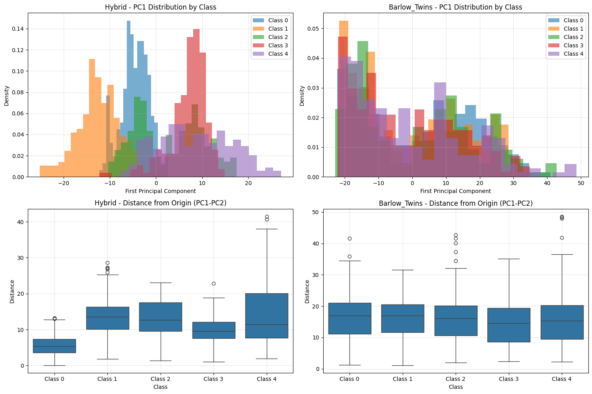
</p>

This final distribution for PC1 by class shows that the hybrid model succeeded in separating the classes (Class 4 still struggles slightly), while the Barlow Twins model has a very similar distribution for class identification. **The individual peaks per classes is a remarkable result for the hybrid model architecture**, and it may insist that this model can be successful on a larger scale.

### Usecase
These models were trained using 3x3 cropped and augmented images. The goal for this approach was to:
1. Allow the model to be trained on more samples, by splitting up the training data and augmenting images for the models to work with.
2. Allow the user to sample the AFM tip in real-time **without having to complete a full scan**. Hence, the user can feed up to 9 samples into the model at a time and get predictions about the status of the tip during runtime. **This can be used to stop the AFM in cases where the tip may be close to breaking (classes 2-3).**

Further improvements to the interface between these models and realtime data must be made, but for now the model has the capability for smaller samples of data to be used to predict the classification of the tip.

# Grid-Based Training
Using the data gathered from the grid experiment, the same trends from the smaller dataset are visible. Some effort will have to be put into isolating the classifications in the intermediate classes.

## Rewards
<p align="center">
  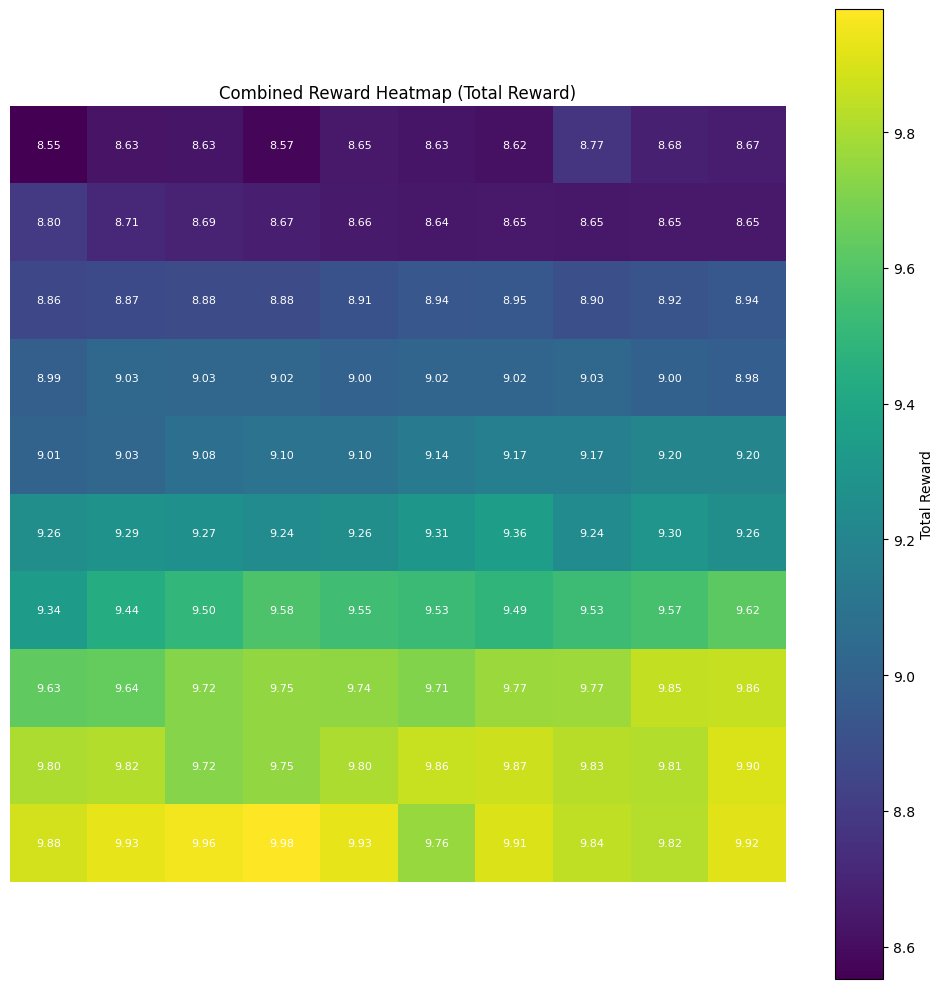
</p>

The reward distribution of images (top left is index 0, bottom right is index 99). The goal for this distribution is to **allow the model to "see" the reward trend over time as the tip becomes more worn**. This data-driven approach should increase the accuracy of classification over just standard image-based learning.

The rewards are calculated as combination of trace and retrace data and map data. That is, the `consistency` rewards are mean absolute error calculations between trace and retrace values, while `entropy`, `skew`, and `std` are all statistical values taken across the entire image for just the trace.

### Reward Weights
The reward weight distribution used to generate the heatmap above is given below. This exploration is kept in `exp2.ipynb`.
`
  reward_weights = {
        'phase_consistency': 2.5,
        'amplitude_consistency': 0.25,
        'height_consistency': 2.5,
        'tip_freshness': 0.00,
        'amplitude_std': 0.75,
        'height_entropy': 1.0,
        'phase_std': 2.0,
        'height_skew': 2.5,
        'phase_skew': 0.75
    }
`

## Large Dataset Changes
The large dataset now contains 200 images, which through 72x augmentation, yields **14400 unqiue augments to train on**. This high augmentation level allows the model to be trained on more data as compared to the 71 images previously at the same augmentation ratio.

## Results
<p align="center">
  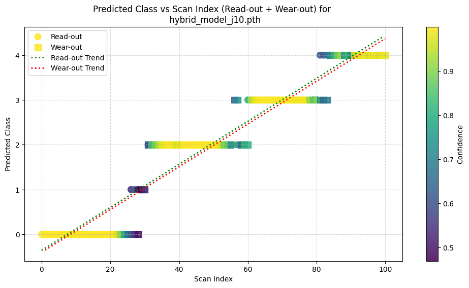
</p>
<p align="center">
  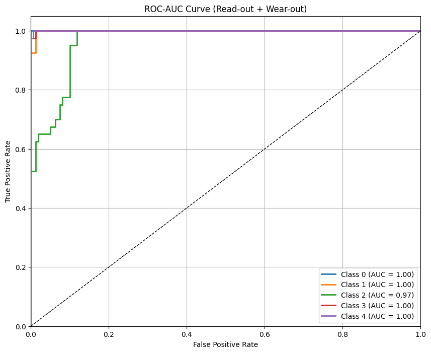
</p>
<p align="center">
  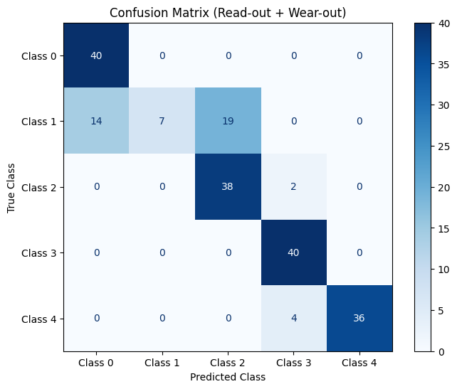
</p>

<p align="center">
  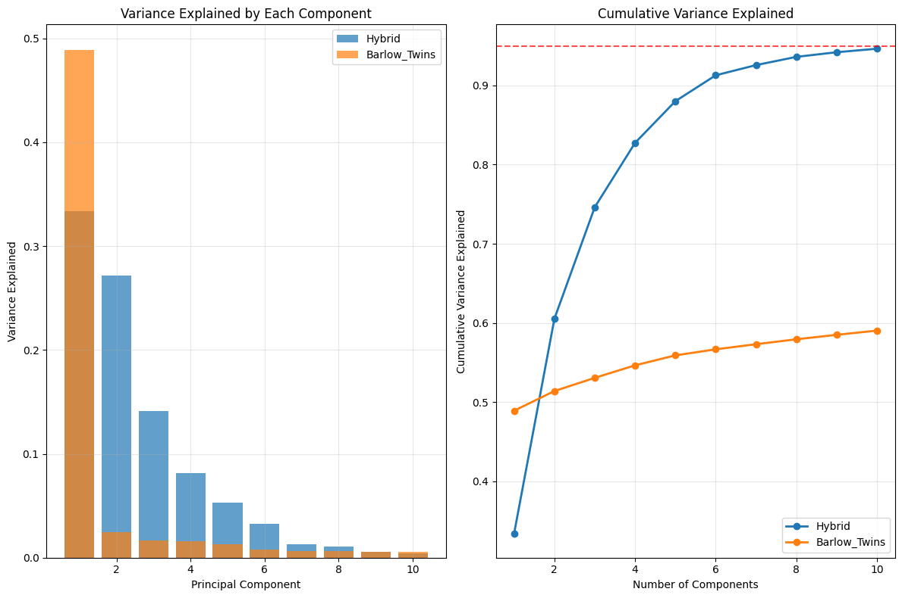
</p>

<p align="center">
  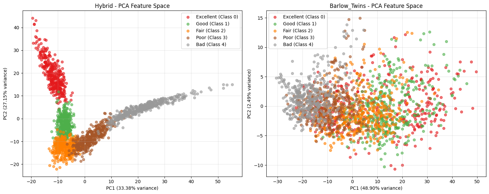
</p>

<p align="center">
  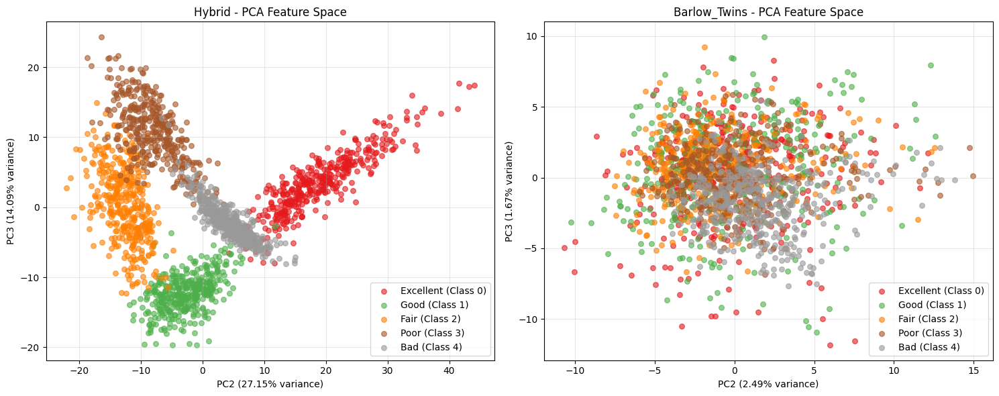
</p>

<p align="center">
  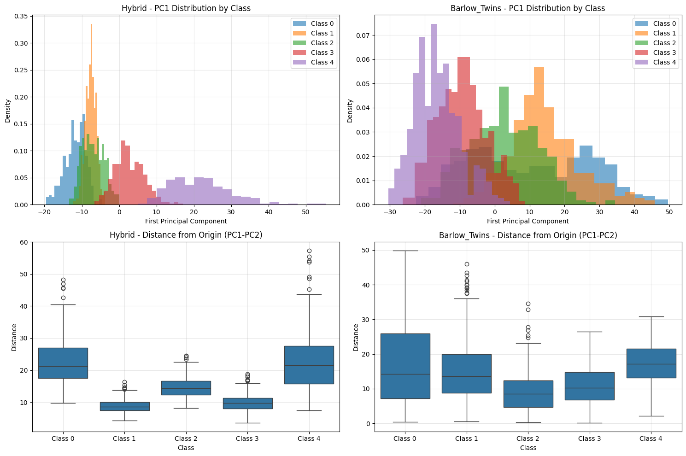
</p>

# Upcoming
Adding real-time prediction for use in the AFM and possibly training with more images. This could also lead into live training using new images as the model predicts, which would lead into a full suite.

Updating documentation around training and polishing the `tools.py` module.

## Has not been updated to reflect changes in ground-truth labeling. Follow the exploration in `exp2.ipynb` for this process.
## Scripts for training have been updated to use this process.

# Submission Version 2
After coming to a development standstill:
+ The project uses the same development process, but instead of using scan index for direct labeling, we use the stratified reward distribution to determine classes.

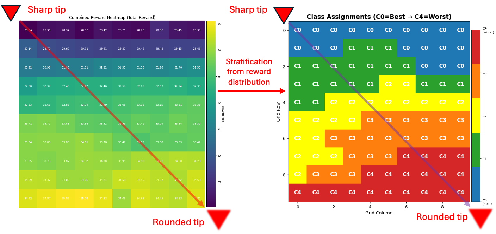

+ The automated experiment has a better description, of which the image is given below:
 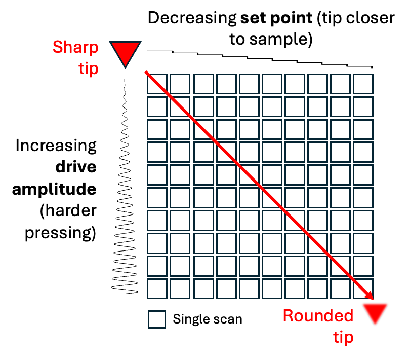
 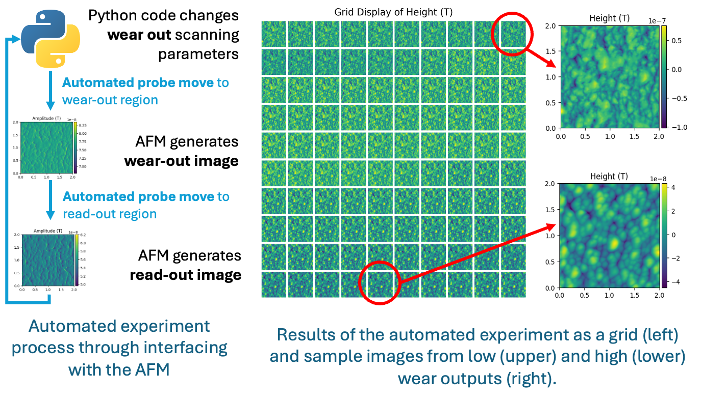

+ The regressor head still performs very poorly. Some **experimental adaptations of the linear regressor to minimize RMSE works fairly well, though that adaptation is not covered.

+ Final classification comparisons are given:
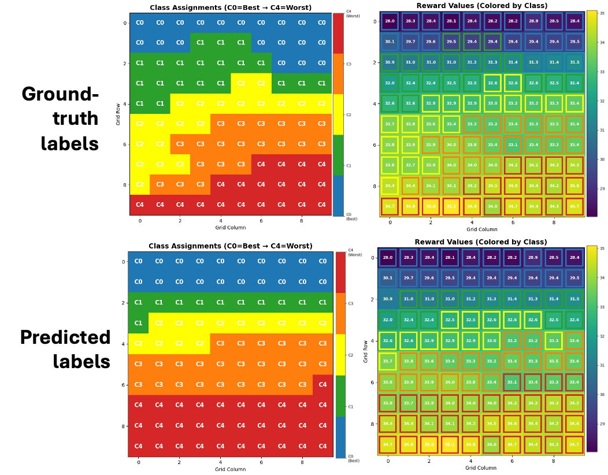
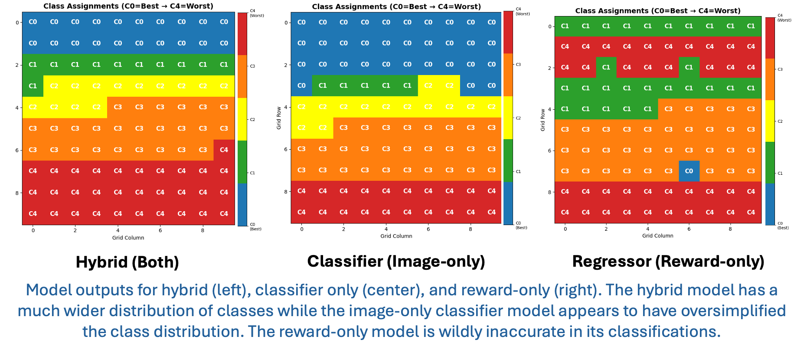

+ Updated diagrams for training:
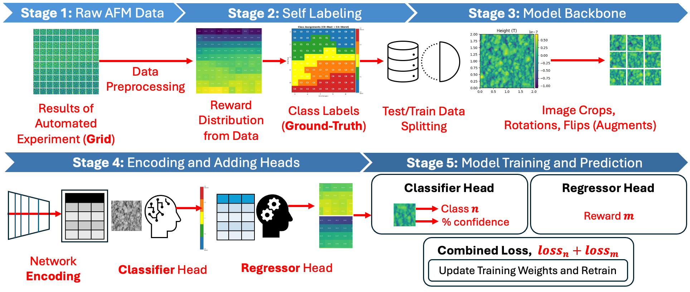

# Further Changes or Possible Updates
+ Adapting the regressor to be more accurate. It would be fairly understandable that a data-based regressor can learn the distribution of ground-truth labels and add to the consistency of the classifier head instead of performing poorly.
+ Exploration into an updated linear regressor model shows that it has strong classification accuracy (near 100%), but this is expected and not learnable in a general sense since the distribution is man-made and not generalizable to many samples.

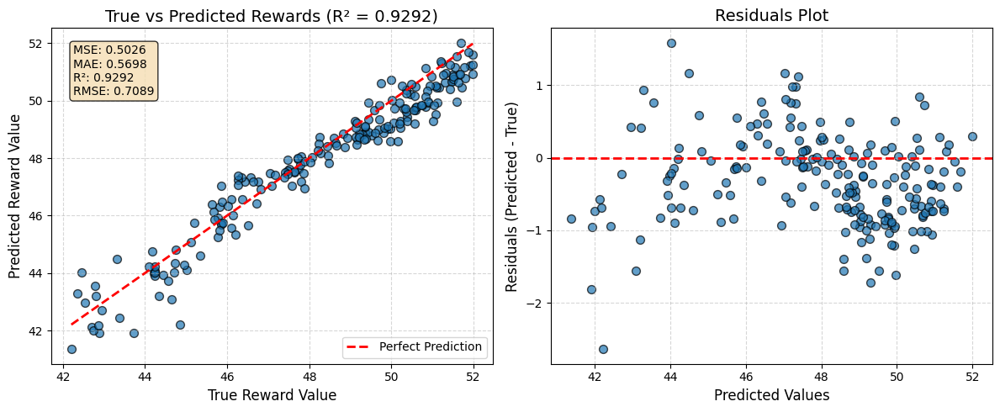
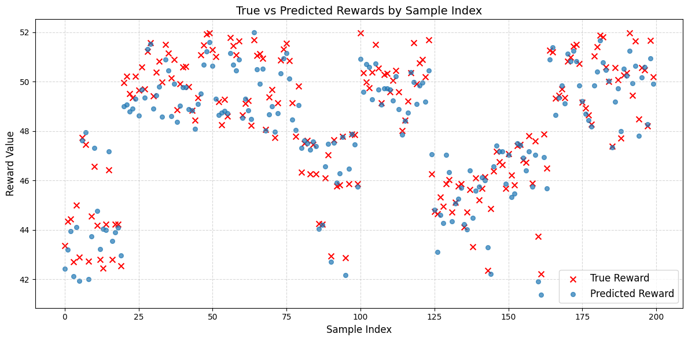
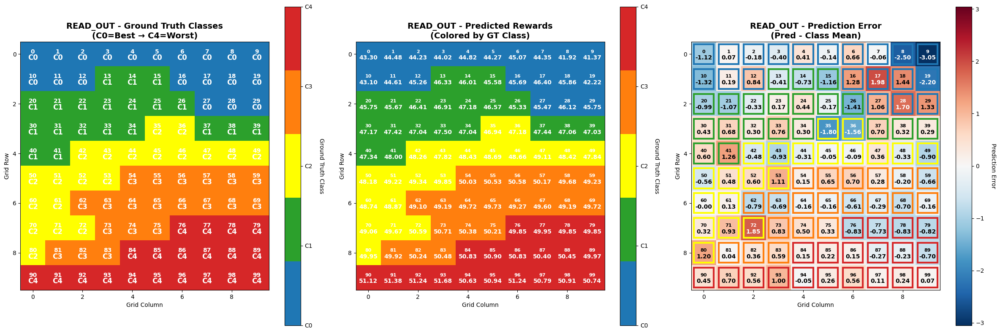

## Using generative AI to prototype the adaptation of the new regressor model shows promising results, but the codebase is too large and convoluted for a final product. 
## This exploration is kept in `test.ipynb`, but it is not clear. The last few functions cover basic training but I could not adapt augmentation or more advanced testing procedures due to time constraints.
## Model accuracy appears to converge at the same rate as the current hybrid approach, but the adapted regressor still performs much better. Perhaps hyperparameter/loss function tuning could result in near perfect classification.

### Classification Accuracy for Adapted Regressor


### Ground Truth Labels for Adapted Regressor


### Ground Truth Reward Distribution for Adapted Regressor


### Predicted Labels Grid for Adapted Regressor


### Predicted Rewards Distribution for Adapted Regressor


### Regression Error Distribution for Adapted Regressor


# Further additions
Notebook from testing should be added, could not find it in directory.