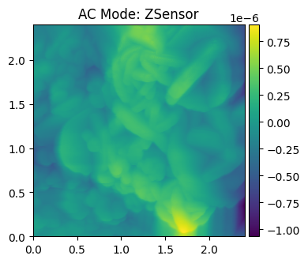

# ofdspm
## Outlier/Failure Detector for Scanning Probe Microscopes at the Image Level
This is a working repository for a solution to errors presented in scanning probe microscopes between the trace and retrace. Ideally, the difference between the values measured should be zero between the trace and retrace, but in reality they are not. 

This leads to several issues with images created from the SPM, including "bad" images and lines where the tip fails to get accurate readings. Sample images are given below.

<p float="left">
  
  
</p>

For reference, good images do not have tip failures from the SPM. These images are given below:
<p float="left">
  
  
</p>


With reference to the `aespm library`, this repository explores ways to develop algorithms to detect "bad" images either as a result of statistical anomalies or from machine learning.
+ Refer to the Jupyter notebook `simulator.ipynb` for this exploration.

This repository also has a few CLI files that may be used to test and train a machine learning (ML) algorithm to classify a given `.ibw` file as "good" or "bad" based on a select sample of manually-reviewed files. At the current status of this repository, it appears that the model is highly biased towards good images (imbalance with the number of bad images), and as such is **good at detecting good images, but not good at detecting bad images**. A new (larger) dataset will likely improve the performance analytics.

## Files
This repository contains a main Jupyter notebook, `simulator.ipnyb`, which outlines the development of several Python scripts and algorithms to classify and handle these images. The notebook also expands on previous libraries for processing `.ibw` files and even synthesizing good and bad images.

Data is taken from `.ibw` files and placed into **pandas DataFrames** to be analyzed by the ML algorithm. Currently, the algorithm chosen is **RandomForestClassifier**, specifically chosen for its accuracy from experimentation and efficiency. The synthesis script uses **XGBoostClassifier** as its model because of the large synthesized training set.

### List of Files/Folders
+ `images/`   (folder): Images folder for documentation/readme.md
+ `sample_data/`  (folder): Given `.ibw` files, unsorted/cleaned.
+ `sorted_data/`  (folder):   Manually-sorted `.ibw` files, cleaned.
+ `RandomForest_model.pkl`    (ML model): Pickled ML model from the most recent sample training.
+ `synthetic_image_quality_model.pkl` (ML model): Pickled ML model from the most recent synthetic training.
+ `requirements.txt`    (text): Requirements file for external libs.
+ `simulator.ipynb` (Jupyter notebook): As referenced above, contains the main development workflow.
+ `test.py` (script):   Test script for training and testing a model with real images (no CLI).
+ `train.py` (script):  Used for training a synthetic ML model for testing with real images (contains CLI).
+ `utils.py` (module):  Contains shared utility functions used for feature extraction, residuals, and statistics.

## Methodology
The method by which a ML algorithm is trained and tested for several source files varies by the type of model created. For real images, a RandomForestClassifier model is chosen for its experimental accuracy and ease. For synthesized images, the XGBooostClassifier algorithm is used instead.

The method by which data is taken from the `.ibw` files and converted into **pandas DataFrames** is through means of the `aespm library`'s tools to manage, view, and store values from these files.

Since some of the source files contain different channels of information, this repository elected to grab the four most common channels and train the ML model on those:
+ Height
+ Amplitude
+ Phase
+ ZSensor

Currently, most images exist as 256-by-256-point DataFrames with four channels per point. Since this repo is handling point-based classification, this implies why RandomForestClassifier is being used for tabular/structured data.

## Effectiveness
The effectiveness of the current ML model is limited by the sorted data set. Currently, there are **58 good images and 14 bad images**. This is not nearly enough and introduces bias to the training set. Using the standard 80/20% split, the ML model is excellent at finding good images, but suffers at finding bad images.

A sample output from `test.py` is given below:
```
=== TRAINING ML MODEL (MATCHED TO PREDICTION) ===
Target channels: ['Height', 'Amplitude', 'Phase', 'ZSensor']
Expected features: 4 channels * 4 stats + 6 pairs = 22
Found 58 good image files
Found 14 bad image files
Feature names (22): ['Amplitude_std', 'Amplitude_range', 'Amplitude_entropy', 'Amplitude_skew', 'Height_std', 'Height_range', 'Height_entropy', 'Height_skew', 'Phase_std', 'Phase_range', 'Phase_entropy', 'Phase_skew', 'ZSensor_std', 'ZSensor_range', 'ZSensor_entropy', 'ZSensor_skew', 'Amplitude_Height_residual', 'Amplitude_Phase_residual', 'Amplitude_ZSensor_residual', 'Height_Phase_residual', 'Height_ZSensor_residual', 'Phase_ZSensor_residual']
Successfully processed 58 good images
Successfully processed 14 bad images
Final training data: 72 samples, 22 features
Good images: 58, Bad images: 14
Training accuracy: 1.000
Test accuracy: 1.000
Cross-validation score: 0.876 (+/- 0.094)

Top 10 Most Important Features:
            feature  importance
0     Amplitude_std    0.132955
7       Height_skew    0.127915
11       Phase_skew    0.094534
8         Phase_std    0.085190
4        Height_std    0.084544
3    Amplitude_skew    0.081063
15     ZSensor_skew    0.065603
1   Amplitude_range    0.043449
9       Phase_range    0.039667
13    ZSensor_range    0.033934
Model saved as 'RandomForest_model.pkl'
Size of data (rows): 256
Current mode: AC Mode
Channels: ['Height', 'Amplitude', 'Phase', 'ZSensor']
Size (meters): 2e-06
ML feature vector shape: (1, 22)
Expected features: 4 channels * 4 stats + 6 residuals = 22
=== ENHANCED FAILURE ANALYSIS ===
Traditional failure: False (score: 0 of 0)
Multiple entropy failure: True (score: 4 flags of 4)
High proximity failure: True (score: 0.998)
ML failure: False (probability: 0.000)
OVERALL FAILURE: False

=== PROXIMITY TO THRESHOLDS ===
Height:
  std_proximity: 1.001 CLOSE
  range_proximity: 0.985 CLOSE
  skew_proximity: 1.000 CLOSE
Amplitude:
  std_proximity: 1.007 CLOSE
  range_proximity: 0.986 CLOSE
  skew_proximity: 1.006 CLOSE
Phase:
  std_proximity: 1.005 CLOSE
  range_proximity: 0.993 CLOSE
  skew_proximity: 1.004 CLOSE
ZSensor:
  std_proximity: 1.000 CLOSE
  range_proximity: 0.988 CLOSE
  skew_proximity: 1.003 CLOSE

=== TOP CONTRIBUTING FEATURES (ML) ===
Amplitude_std: 0.133
Height_skew: 0.128
Phase_skew: 0.095
Phase_std: 0.085
Height_std: 0.085
Amplitude_skew: 0.081
ZSensor_skew: 0.066
Amplitude_range: 0.043
```

Since this output contains a lot of clutter, it is important to note that **this program only considers the classification output of the ML model, labeled `ML failure`**. Other sample statistics are placed for debugging and observational purposes only. Though there is significant impact from the good images about thresholds (they impact the weights of the training columns), in reality they do not change between runs or changes between files.

**To improve or modify the ML source files**, more files must be added to the `sorted_data/` directory in this repo.

### Training a Synthetic Model (XGBoostClassifier)
To train a synthetic model using `train.py`, there is a CLI interface and some code that can be modified. Although the entire interface has not been written, it is still possible to generate, view, and train a model to a specific size. The CLI is as follows:

```
Main function call:
For CLI:
+ Use --show to show the synthetic sample, if needed
+ Use --generate to generate a new ML model. Configure the size of the synthesized set as needed.
+ Use --file {str} to choose the file other than the default to compare.

Actions:
+ Creates a synthetic image to view
+ Creates a batch of synthetic images to train a new model if requested
+ Checks the given file against created thresholds from given data and the ML's decision
+ Outputs results
```

The reason that **this model uses XGBoostClassifier** is because it performs slightly better with large datasets (thousands of points in this case), as compared to the RandomForestsClassifier given for the real images. This can be modified within the source file, but experimentation might cause the training model to take many more minutes/hours than the current version.

### Training a ML Model (RandomForestsClassifier) Using Real Images
To train a ML model using real `.ibw` files, the `test.py` file can automatically refer to the repo's `sorted_data/` folder and train and test a model. There is not a CLI for this tester yet, but one may be added in the future. The default image is a good image, and the result above is from that image's run.

Experiment with the accuracy of the ML model in predicting the impact of the four chosen channels of data on the classification of good or bad.

## Sample Outputs and Analysis
This section will contain some sample images/outputs from the ML training and how they relate to whether or not the model has been trained well.

### Bad Images
The ML model is trained with the same set (although random training/testing set), so we can expect it to behave relatively the same per run.

The bad images (3) chosen for this test run are shown below with their paths.

#### Bad Image 1
Path: `sorted_data/bad_images/PositionC_30Cs70M0000.ibw`
<p float="left">
  
  
</p>
<p float="left">
  
  
</p>

The following is the output from the `test.py` training with this filepath given (truncated):
```
=== TRAINING ML MODEL (MATCHED TO PREDICTION) ===
Target channels: ['Height', 'Amplitude', 'Phase', 'ZSensor']
Expected features: 4 channels * 4 stats + 6 pairs = 22
Found 58 good image files
Found 14 bad image files
Feature names (22): ['Amplitude_std', 'Amplitude_range', 'Amplitude_entropy', 'Amplitude_skew', 'Height_std', 'Height_range', 'Height_entropy', 'Height_skew', 'Phase_std', 'Phase_range', 'Phase_entropy', 'Phase_skew', 'ZSensor_std', 'ZSensor_range', 'ZSensor_entropy', 'ZSensor_skew', 'Amplitude_Height_residual', 'Amplitude_Phase_residual', 'Amplitude_ZSensor_residual', 'Height_Phase_residual', 'Height_ZSensor_residual', 'Phase_ZSensor_residual']
Successfully processed 58 good images
Successfully processed 14 bad images
Final training data: 72 samples, 22 features
Good images: 58, Bad images: 14
Training accuracy: 1.000
Test accuracy: 1.000
Cross-validation score: 0.876 (+/- 0.094)

Top 10 Most Important Features:
            feature  importance
0     Amplitude_std    0.132955
7       Height_skew    0.127915
11       Phase_skew    0.094534
8         Phase_std    0.085190
4        Height_std    0.084544
3    Amplitude_skew    0.081063
15     ZSensor_skew    0.065603
1   Amplitude_range    0.043449
9       Phase_range    0.039667
13    ZSensor_range    0.033934
Model saved as 'RandomForest_model.pkl'
Size of data (rows): 118
Current mode: AC Mode
Channels: ['Height', 'Amplitude', 'Phase', 'ZSensor']
Size (meters): 3e-05
ML feature vector shape: (1, 22)
Expected features: 4 channels * 4 stats + 6 residuals = 22
=== ENHANCED FAILURE ANALYSIS ===
Traditional failure: False (score: 0 of 0)
Multiple entropy failure: True (score: 4 flags of 4)
High proximity failure: False (score: 0.662)
ML failure: True (probability: 0.680)
OVERALL FAILURE: False
```

**ML failure: True (probability: 0.680)**

#### Bad Image 2

Path: `sorted_data/bad_images/H_90Cs10MA_0006.ibw`
<p float="left">
  
  
</p>
<p float="left">
  
  
</p>

The following is the output from the `test.py` training with this filepath given (truncated):
```
=== TRAINING ML MODEL (MATCHED TO PREDICTION) ===
Target channels: ['Height', 'Amplitude', 'Phase', 'ZSensor']
Expected features: 4 channels * 4 stats + 6 pairs = 22
Found 58 good image files
Found 14 bad image files
Feature names (22): ['Amplitude_std', 'Amplitude_range', 'Amplitude_entropy', 'Amplitude_skew', 'Height_std', 'Height_range', 'Height_entropy', 'Height_skew', 'Phase_std', 'Phase_range', 'Phase_entropy', 'Phase_skew', 'ZSensor_std', 'ZSensor_range', 'ZSensor_entropy', 'ZSensor_skew', 'Amplitude_Height_residual', 'Amplitude_Phase_residual', 'Amplitude_ZSensor_residual', 'Height_Phase_residual', 'Height_ZSensor_residual', 'Phase_ZSensor_residual']
Successfully processed 58 good images
Successfully processed 14 bad images
Final training data: 72 samples, 22 features
Good images: 58, Bad images: 14
Training accuracy: 1.000
Test accuracy: 1.000
Cross-validation score: 0.876 (+/- 0.094)

Top 10 Most Important Features:
            feature  importance
0     Amplitude_std    0.132955
7       Height_skew    0.127915
11       Phase_skew    0.094534
8         Phase_std    0.085190
4        Height_std    0.084544
3    Amplitude_skew    0.081063
15     ZSensor_skew    0.065603
1   Amplitude_range    0.043449
9       Phase_range    0.039667
13    ZSensor_range    0.033934
Model saved as 'RandomForest_model.pkl'
Size of data (rows): 256
Current mode: AC Mode
Channels: ['Height', 'Amplitude', 'Phase', 'ZSensor']
Size (meters): 1e-06
ML feature vector shape: (1, 22)
Expected features: 4 channels * 4 stats + 6 residuals = 22
=== ENHANCED FAILURE ANALYSIS ===
Traditional failure: False (score: 0 of 0)
Multiple entropy failure: True (score: 4 flags of 4)
High proximity failure: False (score: 0.710)
ML failure: True (probability: 0.780)
OVERALL FAILURE: False
```

**ML failure: True (probability: 0.780)**

#### Bad Image 3
Path: `sorted_data/bad_images/H_90Cs10MA_0004.ibw`
<p float="left">
  
  
</p>
<p float="left">
  
  
</p>
The following is the output from the `test.py` training with this filepath given (truncated):

```
=== TRAINING ML MODEL (MATCHED TO PREDICTION) ===
Target channels: ['Height', 'Amplitude', 'Phase', 'ZSensor']
Expected features: 4 channels * 4 stats + 6 pairs = 22
Found 58 good image files
Found 14 bad image files
Feature names (22): ['Amplitude_std', 'Amplitude_range', 'Amplitude_entropy', 'Amplitude_skew', 'Height_std', 'Height_range', 'Height_entropy', 'Height_skew', 'Phase_std', 'Phase_range', 'Phase_entropy', 'Phase_skew', 'ZSensor_std', 'ZSensor_range', 'ZSensor_entropy', 'ZSensor_skew', 'Amplitude_Height_residual', 'Amplitude_Phase_residual', 'Amplitude_ZSensor_residual', 'Height_Phase_residual', 'Height_ZSensor_residual', 'Phase_ZSensor_residual']
Successfully processed 58 good images
Successfully processed 14 bad images
Final training data: 72 samples, 22 features
Good images: 58, Bad images: 14
Training accuracy: 1.000
Test accuracy: 1.000
Cross-validation score: 0.876 (+/- 0.094)

Top 10 Most Important Features:
            feature  importance
0     Amplitude_std    0.132955
7       Height_skew    0.127915
11       Phase_skew    0.094534
8         Phase_std    0.085190
4        Height_std    0.084544
3    Amplitude_skew    0.081063
15     ZSensor_skew    0.065603
1   Amplitude_range    0.043449
9       Phase_range    0.039667
13    ZSensor_range    0.033934
Model saved as 'RandomForest_model.pkl'
Size of data (rows): 62
Current mode: AC Mode
Channels: ['Height', 'Amplitude', 'Phase', 'ZSensor']
Size (meters): 1e-05
ML feature vector shape: (1, 22)
Expected features: 4 channels * 4 stats + 6 residuals = 22
=== ENHANCED FAILURE ANALYSIS ===
Traditional failure: False (score: 0 of 0)
Multiple entropy failure: True (score: 4 flags of 4)
High proximity failure: False (score: 0.660)
ML failure: True (probability: 0.700)
OVERALL FAILURE: False
```
**ML failure: True (probability: 0.700)**

#### Analysis
The three samples given all show the ML succeeding in identifying them as "bad images." Though, it must be mentioned that these images represent a select sample of images that *can be sampled*. Since many `.ibw` files do not contain the four channels that the ML is training on, it is not possible to predict with these files. They still may be used for creating thresholds and training the ML.

The average score from these images is **0.720**. So, we can state that the ML model is about 72% confident that these images are "bad images".

Next, we should look at how the model classifies known good images.

### Good Images
The good images (3) chosen for this test run are shown below with their paths.

#### Good Image 1
Path: `sorted_data/good_images/HeightCali0027.ibw`
<p float="left">
  
  
</p>
<p float="left">
  
  
</p>

The following is the output from the `test.py` training with this filepath given (truncated):
```
=== TRAINING ML MODEL (MATCHED TO PREDICTION) ===
Target channels: ['Height', 'Amplitude', 'Phase', 'ZSensor']
Expected features: 4 channels * 4 stats + 6 pairs = 22
Found 58 good image files
Found 14 bad image files
Feature names (22): ['Amplitude_std', 'Amplitude_range', 'Amplitude_entropy', 'Amplitude_skew', 'Height_std', 'Height_range', 'Height_entropy', 'Height_skew', 'Phase_std', 'Phase_range', 'Phase_entropy', 'Phase_skew', 'ZSensor_std', 'ZSensor_range', 'ZSensor_entropy', 'ZSensor_skew', 'Amplitude_Height_residual', 'Amplitude_Phase_residual', 'Amplitude_ZSensor_residual', 'Height_Phase_residual', 'Height_ZSensor_residual', 'Phase_ZSensor_residual']
Successfully processed 58 good images
Successfully processed 14 bad images
Final training data: 72 samples, 22 features
Good images: 58, Bad images: 14
Training accuracy: 1.000
Test accuracy: 1.000
Cross-validation score: 0.876 (+/- 0.094)

Top 10 Most Important Features:
            feature  importance
0     Amplitude_std    0.132955
7       Height_skew    0.127915
11       Phase_skew    0.094534
8         Phase_std    0.085190
4        Height_std    0.084544
3    Amplitude_skew    0.081063
15     ZSensor_skew    0.065603
1   Amplitude_range    0.043449
9       Phase_range    0.039667
13    ZSensor_range    0.033934
Model saved as 'RandomForest_model.pkl'
Size of data (rows): 512
Current mode: AC Mode
Channels: ['Height', 'Amplitude', 'Phase', 'ZSensor']
Size (meters): 2e-05
ML feature vector shape: (1, 22)
Expected features: 4 channels * 4 stats + 6 residuals = 22
=== ENHANCED FAILURE ANALYSIS ===
Traditional failure: False (score: 0 of 0)
Multiple entropy failure: False (score: 0 flags of 4)
High proximity failure: False (score: 0.430)
ML failure: False (probability: 0.030)
OVERALL FAILURE: False
```

**ML failure: False (probability: 0.030)**

#### Good Image 2
Path: `sorted_data/good_images/PTO_AC_0000.ibw`

<p float="left">
  
  
</p>
<p float="left">
  
  
</p>

The following is the output from the `test.py` training with this filepath given (truncated):

```
=== TRAINING ML MODEL (MATCHED TO PREDICTION) ===
Target channels: ['Height', 'Amplitude', 'Phase', 'ZSensor']
Expected features: 4 channels * 4 stats + 6 pairs = 22
Found 58 good image files
Found 14 bad image files
Feature names (22): ['Amplitude_std', 'Amplitude_range', 'Amplitude_entropy', 'Amplitude_skew', 'Height_std', 'Height_range', 'Height_entropy', 'Height_skew', 'Phase_std', 'Phase_range', 'Phase_entropy', 'Phase_skew', 'ZSensor_std', 'ZSensor_range', 'ZSensor_entropy', 'ZSensor_skew', 'Amplitude_Height_residual', 'Amplitude_Phase_residual', 'Amplitude_ZSensor_residual', 'Height_Phase_residual', 'Height_ZSensor_residual', 'Phase_ZSensor_residual']
Successfully processed 58 good images
Successfully processed 14 bad images
Final training data: 72 samples, 22 features
Good images: 58, Bad images: 14
Training accuracy: 1.000
Test accuracy: 1.000
Cross-validation score: 0.876 (+/- 0.094)

Top 10 Most Important Features:
            feature  importance
0     Amplitude_std    0.132955
7       Height_skew    0.127915
11       Phase_skew    0.094534
8         Phase_std    0.085190
4        Height_std    0.084544
3    Amplitude_skew    0.081063
15     ZSensor_skew    0.065603
1   Amplitude_range    0.043449
9       Phase_range    0.039667
13    ZSensor_range    0.033934
Model saved as 'RandomForest_model.pkl'
Size of data (rows): 256
Current mode: AC Mode
Channels: ['Height', 'Amplitude', 'Phase', 'ZSensor']
Size (meters): 1e-05
ML feature vector shape: (1, 22)
Expected features: 4 channels * 4 stats + 6 residuals = 22
=== ENHANCED FAILURE ANALYSIS ===
Traditional failure: False (score: 0 of 0)
Multiple entropy failure: True (score: 4 flags of 4)
High proximity failure: True (score: 0.994)
ML failure: False (probability: 0.010)
OVERALL FAILURE: False
```
**ML failure: False (probability: 0.010)**

#### Good Image 3
Path: `sorted_data/good_images/Cs50MA50approx_0003.ibw`

<p float="left">
  
  
</p>
<p float="left">
  
  
</p>

The following is the output from the `test.py` training with this filepath given (truncated):
```
=== TRAINING ML MODEL (MATCHED TO PREDICTION) ===
Target channels: ['Height', 'Amplitude', 'Phase', 'ZSensor']
Expected features: 4 channels * 4 stats + 6 pairs = 22
Found 58 good image files
Found 14 bad image files
Feature names (22): ['Amplitude_std', 'Amplitude_range', 'Amplitude_entropy', 'Amplitude_skew', 'Height_std', 'Height_range', 'Height_entropy', 'Height_skew', 'Phase_std', 'Phase_range', 'Phase_entropy', 'Phase_skew', 'ZSensor_std', 'ZSensor_range', 'ZSensor_entropy', 'ZSensor_skew', 'Amplitude_Height_residual', 'Amplitude_Phase_residual', 'Amplitude_ZSensor_residual', 'Height_Phase_residual', 'Height_ZSensor_residual', 'Phase_ZSensor_residual']
Successfully processed 58 good images
Successfully processed 14 bad images
Final training data: 72 samples, 22 features
Good images: 58, Bad images: 14
Training accuracy: 1.000
Test accuracy: 1.000
Cross-validation score: 0.876 (+/- 0.094)

Top 10 Most Important Features:
            feature  importance
0     Amplitude_std    0.132955
7       Height_skew    0.127915
11       Phase_skew    0.094534
8         Phase_std    0.085190
4        Height_std    0.084544
3    Amplitude_skew    0.081063
15     ZSensor_skew    0.065603
1   Amplitude_range    0.043449
9       Phase_range    0.039667
13    ZSensor_range    0.033934
Model saved as 'RandomForest_model.pkl'
Size of data (rows): 256
Current mode: AC Mode
Channels: ['Height', 'Amplitude', 'Phase', 'ZSensor']
Size (meters): 2.4e-06
ML feature vector shape: (1, 22)
Expected features: 4 channels * 4 stats + 6 residuals = 22
=== ENHANCED FAILURE ANALYSIS ===
Traditional failure: False (score: 0 of 0)
Multiple entropy failure: True (score: 4 flags of 4)
High proximity failure: True (score: 0.801)
ML failure: False (probability: 0.000)
OVERALL FAILURE: False
```

**ML failure: False (probability: 0.000)**

#### Analysis
The ML is fairly confident with detecting good images. This is likely explained by the current testing set, because most of the images given are "good images."

The average score from these images is **0.013**. We should likely explore the ML's ability to detect more "difficult-to-see" good images.